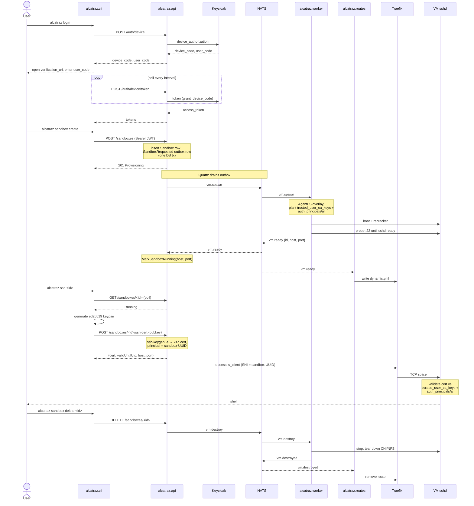

# Alcatraz

A serverless sandbox platform for AI coding agents.

[](https://dotnet.microsoft.com/)
[](https://go.dev/)
[](https://firecracker-microvm.github.io/)
[](LICENSE)

## Table of contents

- [What is Alcatraz?](#what-is-alcatraz)
- [Key features](#key-features)
- [Architecture overview](#architecture-overview)
- [Quick start](#quick-start)
- [Project structure](#project-structure)
- [Development guide](#development-guide)
- [Status](#status)
- [Design references](#design-references)
- [Deployment](#deployment)
- [Contributing](#contributing)
- [License](#license)

## What is Alcatraz?

Letting an AI coding agent loose on your laptop is a bad idea. Alcatraz gives each one its own throwaway Linux box in the cloud — spun up from a CLI, hardware-isolated via Firecracker, reachable over SSH with a short-lived certificate. Changes persist into an auditable delta you can diff and replay between runs.

### Problem it solves

- **Hardware-isolated execution** for untrusted agents — KVM-backed microVMs, not containers, not your laptop.
- **No shared keys, no persisted pubkeys** — every connection is a fresh OpenSSH user certificate scoped to one sandbox and expired in 24 hours.
- **Reproducible work** — each sandbox is `clean base image + per-sandbox delta`; diff the delta, replay it, throw it away.
- **Operator-friendly fleet** — Keycloak-backed control plane, NATS-driven multi-host worker pool, Traefik SNI ingress. Nothing bespoke on the data path.

### Use cases

- Per-customer agent hosts for a coding-agent product.
- Ephemeral CI runners for agentic test or refactor jobs.
- Throwaway dev environments where a human or agent can `rm -rf /` without consequence.

## Key features

### For the SSH user

- Stock `ssh` — no plugin, no proxy daemon. The CLI just execs OpenSSH with a cert.
- 24-hour user certificates scoped to a single sandbox UUID; expiry is the revocation primitive.
- Filesystem changes survive sandbox restarts via an AgentFS overlay; the base image is reusable.

### For operators

- Per-customer Firecracker microVMs (KVM-backed, sub-second boot, hard isolation).
- Multi-host NATS-driven worker pool — add a worker, NATS routes spawns to it.
- Keycloak handles identity; the API never sees customer credentials.
- Public TLS ingress via Traefik with SNI-based routing to per-sandbox VMs.

### Platform internals

- **Transactional outbox** — the sandbox row and its `SandboxRequested` message are inserted in one DB transaction; a Quartz job drains the outbox onto NATS. No lost spawns, no double spawns.
- **In-process NFSv3 server per worker** — AgentFS exposes the per-sandbox overlay as NFS straight from the worker process. No external NFS daemon, no shared mount; the VM mounts its own worker directly over the bridge subnet.
- **Boot-from-overlay contract** — every VM boots from `clean base image + per-sandbox delta`. The delta survives restarts and is diffable. The base image is reusable across the fleet.
- **Pre-boot overlay plant** — before `m.Start()`, the worker writes `/etc/ssh/auth_principals/al` (sandbox UUID) and `/etc/ssh/trusted_user_ca_keys` (the API's CA pubkey) into the overlay. sshd validates against these at first connection — no out-of-band provisioning step.
- **Real readiness, not optimistic** — workers TCP-probe `vm_ip:22` until sshd accepts, *then* publish `vm.ready`. The API's `VmReadyConsumer` background service flips the sandbox to `Running` on receipt; the CLI's poll-until-Running keys off the same state machine.
- **SNI-as-routing-key** — the sandbox UUID is the TLS SNI on the wire. Traefik's TCP router matches on it and splices to the worker-reported `host:port`. No HTTP, no app-layer mux, no per-tenant listener.
- **Fanout vs. competing consumers, deliberately** — workers subscribe to `vm.spawn` in a queue group (one worker claims each spawn); `alcatraz.routes` subscribes to `vm.ready`/`vm.destroyed` *without* a queue group so every routes replica sees every event and converges its in-memory routing table.
- **Atomic Traefik reloads** — `alcatraz.routes` writes the dynamic config via a temp-file + rename so Traefik never reads a half-written file during hot-reload.
- **Dual-mode endpoint resolution** — when `Gateway__Host` is unset, the cert-issue response carries the per-sandbox VM IP (local dev, direct-to-bridge). When set, it carries Traefik's address (production). Same code path; one config flips it.
- **Cert-only auth** — the API shells out to `ssh-keygen -s` to mint a 24-hour user cert with `principal = sandbox-UUID`. No per-customer pubkey is ever stored, and no credential persists past TTL.

## Architecture overview

The customer's path from `alcatraz login` to a shell is one auth proxy, one outbox, one NATS subject, one worker, and one TLS-terminating ingress. Each component owns a single slice and talks to its neighbours through narrow contracts.

### Components

#### `alcatraz.cli` — the customer's entry point *(shipped, [README](alcatraz.cli/README.md))*
- Logs the customer in via OAuth device flow (proxied by the API).
- Creates, lists, and deletes sandboxes.
- Polls until the sandbox is `Running`, fetches a short-lived SSH cert, and opens a shell into it via stock `ssh`. SNI on the openssl `ProxyCommand` carries the sandbox UUID so Traefik can route.
- Holds no server state and no long-lived secrets.

#### `alcatraz.api` — the customer-facing control plane *(shipped, [README](alcatraz.api/README.md))*
- Owns customer identity, registration, and the role/permission model.
- Owns the `Sandbox` aggregate and its lifecycle (`Provisioning → Running → Deleting → Deleted/Failed`).
- Acts as the SSH certificate authority — issues short-lived user certs scoped to a single sandbox.
- Dispatches spawn and destroy work to workers via NATS, and consumes `vm.ready` to transition sandboxes to `Running` and persist their endpoint.
- Never holds customer SSH keys, never runs VMs.

#### `alcatraz.worker` — sandbox lifecycle on the host *(shipped, [README](alcatraz.worker/README.md))*
- Claims `vm.spawn` jobs from NATS and runs them.
- Allocates host capacity (slots, IPs, TAPs) per sandbox.
- Sets up and tears down per-sandbox networking and outbound NAT.
- Provides each sandbox with a persistent, auditable filesystem overlay on top of the shared base image, and writes the per-sandbox `auth_principals` + the API's CA pubkey into the overlay before boot.
- Boots and supervises the sandbox VM; publishes `vm.ready` after sshd is reachable and `vm.destroyed` on exit.

#### `alcatraz.core` — the sandbox itself *(shipped, [README](alcatraz.core/README.md))*
- The Linux environment customers actually SSH into.
- Owns the guest OS, the pre-installed developer tooling, and `sshd`.
- Owns the boot-from-overlay contract: a clean, reusable base image plus a per-sandbox delta that survives restarts.
- `sshd` is configured with `TrustedUserCAKeys` and `AuthorizedPrincipalsFile` pointing at files the worker plants into the overlay at spawn time.

#### `alcatraz.routes` — NATS → Traefik route publisher *(shipped, [README](alcatraz.routes/README.md))*
- Subscribes to `vm.ready` (no queue group — fanout) and `vm.destroyed`.
- Maintains an in-memory sandbox→endpoint table.
- Atomically writes Traefik's dynamic file-provider config; Traefik hot-reloads on change.

#### Traefik — public TLS ingress *(off-the-shelf, gated behind `--profile gateway`)*
- Terminates TLS on `:443`, ACME via Let's Encrypt (TLS-ALPN-01) for the public hostname.
- Matches inbound TLS by SNI = sandbox UUID and TCP-splices to the worker-reported VM endpoint.
- The only component reachable from outside the cluster on the SSH path.

### End-to-end request lifecycle



1. **Login.** CLI runs `alcatraz login`. The API initiates Keycloak's OAuth 2.0 device flow; the user signs in once in a browser. The CLI gets a JWT access token. The CLI never sees Keycloak's realm, client_id, or secret.
2. **Create sandbox.** CLI runs `alcatraz sandbox create`. The API persists a `Sandbox` row in `Provisioning` and writes a `SandboxRequested` outbox message in the same DB transaction.
3. **Spawn.** A Quartz job drains the outbox and publishes `vm.spawn` on NATS. A worker in the queue group claims the message, allocates a slot, prepares an AgentFS overlay, plants `/etc/ssh/auth_principals/al` (sandbox UUID) and `/etc/ssh/trusted_user_ca_keys` (API CA pubkey) into the overlay, starts an in-process NFSv3 server, and boots Firecracker.
4. **Ready.** The worker probes `vm_ip:22` until sshd accepts and publishes `vm.ready` on NATS. The API's `VmReadyConsumer` hosted service marks the sandbox `Running` and stores the endpoint. `alcatraz.routes` (gateway profile) updates Traefik's route table for the sandbox.
5. **Get a cert.** CLI runs `alcatraz ssh <id>`. It polls the API until the sandbox is `Running`, generates a workstation ed25519 keypair locally, sends the public key to the API, and the API's SSH CA shells out to `ssh-keygen -s` to sign a 24-hour user cert with `principal = sandbox-UUID`. The cert response includes the routable host:port (Traefik in production, direct VM IP in local dev).
6. **Connect.** The CLI invokes stock `ssh` with the cert. In production it uses `ProxyCommand=openssl s_client -connect ssh.alcatraz.io:443 -servername <id>`; Traefik terminates TLS, matches the SNI, and TCP-splices to the VM's `sshd`. `sshd` validates the cert against the CA pubkey + `auth_principals/al` containing the sandbox UUID — no per-customer key ever touches the VM.
7. **Delete.** On `alcatraz sandbox delete`, the API marks the row `Deleting` and publishes `vm.destroy`. The worker tears down CNI, NFS, and Firecracker, then publishes `vm.destroyed`. `alcatraz.routes` removes the route from Traefik. Cert TTL expiry handles revocation in steady state; KRL is reserved for sub-TTL revocation later.

## Quick start

This walks you from a clean checkout to `alcatraz ssh <id>` on a single Linux host. All commands assume your working directory is the repo root unless noted.

The stack splits into three pieces you start in order:

1. **Guest artifacts** — a kernel and a rootfs in `alcatraz.core/`. Built once; reused by every sandbox.
2. **Control plane** — `alcatraz.api`, Keycloak, Postgres, Redis, NATS, Seq, and the one-shot CA initialiser. All in Docker Compose.
3. **Worker** — `alcatraz.worker`, host-run because it needs KVM and CNI. Watches NATS, boots Firecracker VMs from the guest artifacts.

The compose file has two optional profiles you don't need for local dev: `--profile gateway` adds Traefik + `alcatraz.routes` for public TLS ingress (covered in [Deployment](#deployment)); `--profile demo-sshd` is a legacy Alpine `sshd` stand-in from before the worker existed.

### Prerequisites

On the host:

- Linux with KVM (`grep -E 'vmx|svm' /proc/cpuinfo` returns hits) and `sudo`
- Docker + Docker Compose
- Go 1.22+ and `make` (to build the worker)
- .NET 8 SDK (to build the CLI)
- `debootstrap`, `iptables`, build tools (kernel + rootfs build)
- `agentfs` binary on `PATH` (used by the rootfs/launcher and the worker; see [`alcatraz.core/README.md`](alcatraz.core/README.md))
- `curl`, `jq`, `ssh`, `ssh-keygen`
- A web browser, for the one-time device-flow login

### 1. Install CNI plugins and config

The worker uses the Firecracker SDK's CNI integration. Install the standard plugins, the Firecracker-specific `tc-redirect-tap`, and the Alcatraz bridge config:

```bash
# Standard CNI plugins (bridge, host-local, etc.)
curl -sL https://github.com/containernetworking/plugins/releases/download/v1.0.1/cni-plugins-linux-amd64-v1.0.1.tgz \
  | sudo tar -xz -C /opt/cni/bin/

# tc-redirect-tap (Firecracker-specific)
git clone https://github.com/firecracker-microvm/tc-redirect-tap.git /tmp/tc-redirect-tap
make -C /tmp/tc-redirect-tap && sudo cp /tmp/tc-redirect-tap/tc-redirect-tap /opt/cni/bin/

# Alcatraz bridge conflist
sudo mkdir -p /etc/cni/net.d
sudo cp alcatraz.worker/cni/alcatraz-bridge.conflist /etc/cni/net.d/
```

### 2. Build the guest kernel and rootfs

`alcatraz.core/` builds the Amazon Linux microVM kernel and a Ubuntu 24.04 rootfs that every sandbox boots from. First run takes 15–20 minutes; the artifacts (`alcatraz.core/vmlinux`, `alcatraz.core/rootfs/`) land in the repo and are reused by the worker.

```bash
sudo -E ./alcatraz.core/build-kernel.sh
sudo -E ./alcatraz.core/build-rootfs.sh
```

To smoke-test the artifacts independently of the worker, `sudo -E ./alcatraz.core/run.sh` boots a single Firecracker VM directly with a TAP and NAT — Ctrl-C to stop. Skip this if you just want to get to the CLI.

### 3. Bring up the control plane

```bash
docker compose up -d --build
docker compose logs -f alcatraz.api    # wait for "Now listening on: http://[::]:8080", then Ctrl-C
```

First build is slow (multi-stage .NET image); subsequent runs are fast — drop `--build` unless you've edited `alcatraz.api/src/`, `alcatraz.api/.files/ca-init/`, or compose itself.

What's running by default:

| Service | Port | Purpose |
|---|---|---|
| `alcatraz.api` | `:8080` | Control plane API (also subscribes to `vm.ready`) |
| `alcatraz-idp` | `:8082` | Keycloak with the `alcatraz` realm pre-imported (device flow enabled) |
| `alcatraz-db` | `:5432` | Postgres |
| `alcatraz-redis` | `:6379` | Redis |
| `alcatraz-nats` | `:4222` (mon `:8222`) | NATS broker |
| `alcatraz-seq` | `:8083` | Seq log viewer |
| `alcatraz-ca-init` | — | One-shot: writes the SSH CA key into the shared `alcatraz_ca` volume |

### 4. Sync the SSH CA pubkey to the host

The worker plants the API's CA pubkey into every sandbox overlay before boot, but the worker runs on the host (outside compose) so it can't read the `alcatraz_ca` Docker volume directly. This script copies the public half out to a host path the worker can read:

```bash
sudo alcatraz.worker/scripts/sync-ca-pubkey.sh   # writes /run/alcatraz-ca/alcatraz_ca.pub
```

**Re-run after every host reboot.** `/run` is `tmpfs`, so the file disappears on reboot. The worker refuses to start if the pubkey is missing — and the spawn path double-checks at every claim — to avoid the worst-case failure mode (everything looks healthy, only the customer's `ssh` fails with a generic `Permission denied (publickey)`).

For the full rationale — why the sync exists at all, why `/run`, why the worker fails fast instead of the API, and why Keycloak isn't the SSH CA — see [`alcatraz.worker/docs/ca-pubkey-sync.md`](alcatraz.worker/docs/ca-pubkey-sync.md).

### 5. Build and start the worker

```bash
make -C alcatraz.worker build
sudo -E ./alcatraz.worker/bin/alcatraz-worker
```

`sudo` is required for CNI/NAT operations; `-E` preserves env vars (`WORKER_CA_PUBKEY_PATH` defaults to `/run/alcatraz-ca/alcatraz_ca.pub`). The worker subscribes to `vm.spawn` / `vm.destroy` on NATS and publishes `vm.ready` / `vm.destroyed`. Leave it running in the foreground; open a new terminal for the CLI.

### 6. Build and install the CLI

```bash
./alcatraz.cli/scripts/publish.sh
sudo ln -sf "$(pwd)/alcatraz.cli/dist/alcatraz" /usr/local/bin/alcatraz
```

If you'd rather not install globally, substitute `dotnet run --project alcatraz.cli/src/Alcatraz.Cli --` for `alcatraz` in the commands below.

### 7. Register, log in, create a sandbox, and SSH in

```bash
# Register a user (one-time per stack)
curl -sX POST http://localhost:8080/api/v1/users/register \
  -H 'content-type: application/json' \
  -d '{"email":"demo@alcatraz.local","firstName":"Demo","lastName":"User","password":"demopass"}'

# Device-flow login — the CLI prints a URL and code; sign in in your browser
alcatraz login

# Create a sandbox; the API persists it Provisioning, the worker claims vm.spawn,
# boots Firecracker, probes :22, and publishes vm.ready
ID=$(alcatraz sandbox create --vcpus 2 --memory 2048 --json | jq -r .id)

# Poll until Running, fetch a 24h cert, exec ssh against the bridge IP
alcatraz ssh "$ID"
```

You'll land in `/workspace` as user `al`. To confirm the trust chain from inside the VM:

```bash
cat /etc/ssh/auth_principals/al           # → the sandbox UUID
cat /etc/ssh/trusted_user_ca_keys         # → the API's CA pubkey
```

Other useful CLI commands: `alcatraz sandbox list`, `alcatraz sandbox delete <id>`. A `curl`-only verification of the same flow (with negative test cases) lives at [`alcatraz.api/docs/local-end-to-end.md`](alcatraz.api/docs/local-end-to-end.md).

## Project structure

```
alcatraz/
├── docker-compose.yml # API + IdP + db + cache + msgq; profiles for gateway / demo-sshd
├── alcatraz.api/      # .NET 8 control plane: auth proxy, sandbox aggregate, SSH CA, vm.ready consumer
├── alcatraz.cli/      # .NET 8 customer CLI: device-flow login, sandbox CRUD, SSH cert fetch + ssh wrapper
├── alcatraz.core/     # Firecracker kernel/rootfs build scripts and launchers
├── alcatraz.worker/   # Go worker: NATS sub/pub + CNI + AgentFS/NFS + Firecracker SDK (host-run)
├── alcatraz.routes/   # Go service: NATS → Traefik dynamic-config publisher
└── plans/             # cross-component design docs
```

## Development guide

### Per-component notes

- [`alcatraz.api/README.md`](alcatraz.api/README.md) — control plane (`alcatraz.api` in compose).
- [`alcatraz.worker/README.md`](alcatraz.worker/README.md) — NATS subscriber + Firecracker, host-run (KVM + CNI).
- [`alcatraz.core/README.md`](alcatraz.core/README.md) — kernel and Ubuntu rootfs build.
- [`alcatraz.cli/README.md`](alcatraz.cli/README.md) — customer CLI.
- [`alcatraz.routes/README.md`](alcatraz.routes/README.md) — NATS → Traefik route publisher.
- [`alcatraz.api/docs/local-end-to-end.md`](alcatraz.api/docs/local-end-to-end.md) — `curl`-only walkthrough, negative test cases.

### Running tests

```bash
# Go components
make -C alcatraz.worker test
make -C alcatraz.routes test
```

The .NET projects (`alcatraz.api`, `alcatraz.cli`) don't ship a test suite yet — exercise them via the end-to-end walkthrough above and the `curl` cases in `alcatraz.api/docs/local-end-to-end.md`.

## Status

**Shipped:**

- `alcatraz.cli`, `alcatraz.api`, `alcatraz.worker`, `alcatraz.core`, `alcatraz.routes` — all five components run end-to-end. The local and `--profile gateway` walkthroughs above are the canonical proof.

**Not yet shipped:**

- KRL-based sub-TTL certificate revocation (today, expiry is the only revocation mechanism).
- .NET test suite for `alcatraz.api` and `alcatraz.cli`.
- NATS auth/TLS in the production compose profile.

## Design references

- [`plans/customer-vm-access-ssh-ca.md`](plans/customer-vm-access-ssh-ca.md) — system-of-record for SSH CA, device flow, and gateway architecture.
- [`plans/alcatraz-api-cli-endpoints.md`](plans/alcatraz-api-cli-endpoints.md) — control-plane endpoint spec.
- [`plans/alcatraz-cli.md`](plans/alcatraz-cli.md) — CLI implementation plan.
- [`plans/end-to-end-wrap-up.md`](plans/end-to-end-wrap-up.md) — wrap-up plan covering the worker-reports-back pipeline, overlay writes, Traefik+routes ingress.

## Deployment

### Public-host walkthrough (gateway profile)

For "another laptop connecting from the internet," run on a public host with DNS pointing `ssh.alcatraz.io` (or whatever you set `GATEWAY_AUTOCERT_HOST` to) at the host's public IP, and inbound `:443` open:

```bash
GATEWAY_AUTOCERT_HOST=ssh.alcatraz.io \
docker compose --profile gateway up -d --build

# Tell the API to put Traefik's address in cert responses
docker compose exec alcatraz.api sh -c 'export Gateway__Host=ssh.alcatraz.io; export Gateway__Port=443'  # or set in env

# Worker as before
sudo -E ./alcatraz.worker/bin/alcatraz-worker
```

From the remote laptop, point `alcatraz` at the public API, then `alcatraz login` / `sandbox create` / `alcatraz ssh <id>` works the same. The cert response now carries `ssh.alcatraz.io:443`; the CLI's openssl `ProxyCommand` adds `-servername <id>`; Traefik routes the TLS connection by SNI to the right VM.

### Environment variables

The load-bearing ones at deploy time:

| Variable | Component | Purpose |
|---|---|---|
| `GATEWAY_AUTOCERT_HOST` | compose / `alcatraz.routes` | Public hostname Traefik gets an ACME cert for and that `alcatraz.routes` writes into Traefik's router rule. |
| `Gateway__Host`, `Gateway__Port` | `alcatraz.api` | When set, the cert-issue response carries this `(host, port)` instead of the worker-reported VM endpoint. Unset = local-dev direct-to-VM mode. |
| `Ssh__CA__PrivateKeyPath` | `alcatraz.api` | Path to the SSH CA private key inside the API container. Defaults to `/run/alcatraz-ca/alcatraz_ca` (mounted from the `alcatraz_ca` volume). |
| `Nats__Url` / `NATS_URL` | `alcatraz.api`, `alcatraz.routes` | NATS endpoint. |
| `WORKER_CA_PUBKEY_PATH` | `alcatraz.worker` | Host path to the API's CA pubkey; the worker plants it into each VM's overlay. |

### Production considerations

- **TLS termination** is Traefik's job; nothing else listens on `:443`. Don't put another reverse proxy in front — it would terminate the SNI Traefik needs to route by sandbox UUID.
- **CA key rotation** invalidates every previously issued cert. Treat the `alcatraz_ca` volume as production state; back it up before a planned rotation.
- **NATS auth** is open in the dev compose. Add credentials / TLS before exposing the broker beyond the host.
- **Postgres backups** are out of scope for this repo; the `Sandbox` aggregate is the only stateful thing the API owns.
- **Seq is dev-only** (`alcatraz-seq` in compose). Wire OpenTelemetry exporters to your real observability stack in production.

### Resetting the stack

```bash
docker compose down -v   # drops keycloak_data, alcatraz_ca, traefik_dynamic, traefik_acme volumes
rm -f ~/.config/alcatraz/known_hosts   # bridge IPs (e.g. 172.16.0.10) are reused across resets with a fresh host key
docker compose up -d --build
```

You **must** wipe volumes if you change the realm export — Keycloak only imports on first boot. Wiping `alcatraz_ca` regenerates the CA key (invalidates every previously issued cert). Wiping `traefik_acme` forces ACME re-issuance on the next gateway start. The `known_hosts` purge prevents `Host key verification failed` on the next `alcatraz ssh` after a fresh sandbox lands on a previously-used VM IP.

## Contributing

- Branch from `master`; keep commits scoped and use the existing conventional-commit style (`feat:`, `fix:`, `docs:`, `chore:` — see `git log`).
- Run `make -C alcatraz.worker test` and `make -C alcatraz.routes test` before opening a PR for changes in those components.
- For changes that touch the request lifecycle, re-run the end-to-end walkthrough in [Quick start](#quick-start) and update the Mermaid diagram if the contract changed.

## License

[MIT](LICENSE).
