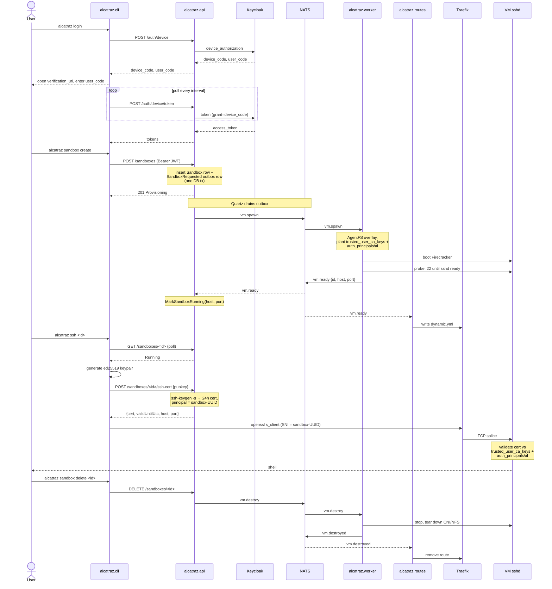

# Alcatraz

A sandboxed environment for letting your coding agents run wild.

Customers spin up isolated, ephemeral Linux sandboxes from a CLI, get a short-lived SSH cert, and connect to a Firecracker microVM whose root filesystem is an audited AgentFS overlay. Base image stays clean; per-sandbox changes persist into a SQLite delta you can diff and replay.

## What you get

- **Per-customer Firecracker microVMs** spawned on demand (KVM-backed, sub-second boot, hard isolation).
- **Stock-`ssh` access via short-lived OpenSSH user certificates** — no shared keys, no pubkey storage, expiry-driven revocation.
- **Audited filesystem changes via AgentFS overlay on NFS** — overlay persists across restarts, base image is reusable.
- **Multi-host NATS-driven worker pool** with a Keycloak-backed control plane.
- **Public TLS ingress via Traefik** with SNI-based routing to per-sandbox VMs (production deployment).

## Components

Each component owns one slice of the customer's path from `alcatraz login` to a shell inside a sandbox.

### `alcatraz.cli` — the customer's entry point *(shipped, [README](alcatraz.cli/README.md))*
- Logs the customer in via OAuth device flow (proxied by the API).
- Creates, lists, and deletes sandboxes.
- Polls until the sandbox is `Running`, fetches a short-lived SSH cert, and opens a shell into it via stock `ssh`. SNI on the openssl `ProxyCommand` carries the sandbox UUID so Traefik can route.
- Holds no server state and no long-lived secrets.

### `alcatraz.api` — the customer-facing control plane *(shipped, [README](alcatraz.api/README.md))*
- Owns customer identity, registration, and the role/permission model.
- Owns the `Sandbox` aggregate and its lifecycle (`Provisioning → Running → Deleting → Deleted/Failed`).
- Acts as the SSH certificate authority — issues short-lived user certs scoped to a single sandbox.
- Dispatches spawn and destroy work to workers via NATS, and consumes `vm.ready` to transition sandboxes to `Running` and persist their endpoint.
- Never holds customer SSH keys, never runs VMs.

### `alcatraz.worker` — sandbox lifecycle on the host *(shipped, [README](alcatraz.worker/README.md))*
- Claims `vm.spawn` jobs from NATS and runs them.
- Allocates host capacity (slots, IPs, TAPs) per sandbox.
- Sets up and tears down per-sandbox networking and outbound NAT.
- Provides each sandbox with a persistent, auditable filesystem overlay on top of the shared base image, and writes the per-sandbox `auth_principals` + the API's CA pubkey into the overlay before boot.
- Boots and supervises the sandbox VM; publishes `vm.ready` after sshd is reachable and `vm.destroyed` on exit.

### `alcatraz.core` — the sandbox itself *(shipped, [README](alcatraz.core/README.md))*
- The Linux environment customers actually SSH into.
- Owns the guest OS, the pre-installed developer tooling, and `sshd`.
- Owns the boot-from-overlay contract: a clean, reusable base image plus a per-sandbox delta that survives restarts.
- `sshd` is configured with `TrustedUserCAKeys` and `AuthorizedPrincipalsFile` pointing at files the worker plants into the overlay at spawn time.

### `alcatraz.routes` — NATS → Traefik route publisher *(shipped, [README](alcatraz.routes/README.md))*
- Subscribes to `vm.ready` (no queue group — fanout) and `vm.destroyed`.
- Maintains an in-memory sandbox→endpoint table.
- Atomically writes Traefik's dynamic file-provider config; Traefik hot-reloads on change.

### Traefik — public TLS ingress *(off-the-shelf, gated behind `--profile gateway`)*
- Terminates TLS on `:443`, ACME via Let's Encrypt (TLS-ALPN-01) for the public hostname.
- Matches inbound TLS by SNI = sandbox UUID and TCP-splices to the worker-reported VM endpoint.
- The only component reachable from outside the cluster on the SSH path.

## End-to-end request lifecycle

%% Customer login → spawn → cert → connect → delete


1. **Login.** CLI runs `alcatraz login`. The API initiates Keycloak's OAuth 2.0 device flow; the user signs in once in a browser. The CLI gets a JWT access token. The CLI never sees Keycloak's realm, client_id, or secret.
2. **Create sandbox.** CLI runs `alcatraz sandbox create`. The API persists a `Sandbox` row in `Provisioning` and writes a `SandboxRequested` outbox message in the same DB transaction.
3. **Spawn.** A Quartz job drains the outbox and publishes `vm.spawn` on NATS. A worker in the queue group claims the message, allocates a slot, prepares an AgentFS overlay, plants `/etc/ssh/auth_principals/al` (sandbox UUID) and `/etc/ssh/trusted_user_ca_keys` (API CA pubkey) into the overlay, starts an in-process NFSv3 server, and boots Firecracker.
4. **Ready.** The worker probes `vm_ip:22` until sshd accepts and publishes `vm.ready` on NATS. The API's `VmReadyConsumer` hosted service marks the sandbox `Running` and stores the endpoint. `alcatraz.routes` (gateway profile) updates Traefik's route table for the sandbox.
5. **Get a cert.** CLI runs `alcatraz ssh <id>`. It polls the API until the sandbox is `Running`, generates a workstation ed25519 keypair locally, sends the public key to the API, and the API's SSH CA shells out to `ssh-keygen -s` to sign a 24-hour user cert with `principal = sandbox-UUID`. The cert response includes the routable host:port (Traefik in production, direct VM IP in local dev).
6. **Connect.** The CLI invokes stock `ssh` with the cert. In production it uses `ProxyCommand=openssl s_client -connect ssh.alcatraz.io:443 -servername <id>`; Traefik terminates TLS, matches the SNI, and TCP-splices to the VM's `sshd`. `sshd` validates the cert against the CA pubkey + `auth_principals/al` containing the sandbox UUID — no per-customer key ever touches the VM.
7. **Delete.** On `alcatraz sandbox delete`, the API marks the row `Deleting` and publishes `vm.destroy`. The worker tears down CNI, NFS, and Firecracker, then publishes `vm.destroyed`. `alcatraz.routes` removes the route from Traefik. Cert TTL expiry handles revocation in steady state; KRL is reserved for sub-TTL revocation later.

## Local development

A single root-level [`docker-compose.yml`](docker-compose.yml) brings up the control plane and supporting services. The worker runs on the host (it needs KVM and CNI). The CLI is built locally.

Two profiles:

- **default** (no profile flag): everything except Traefik, `alcatraz.routes`, and `alcatraz-demo-sshd`. CLI talks directly to the worker-reported VM IP on the bridge subnet — what you want for development on a single host.
- **`--profile gateway`**: also brings up Traefik (`network_mode: host`, ACME on `:443`) and `alcatraz.routes`. What you run on a public host with DNS for `GATEWAY_AUTOCERT_HOST` pointed at it.
- **`--profile demo-sshd`**: a legacy Alpine `sshd` stand-in container that pre-dates the worker. Useful only if you want to test the cert pipeline without running a worker.

### Prerequisites

- Docker Compose
- `curl`, `jq`, `ssh-keygen`, `ssh` on the host
- A web browser (one click during device-flow login)
- .NET 8 SDK to run the CLI (or use `dotnet run --project alcatraz.cli/src/Alcatraz.Cli`)
- For the worker: KVM, CNI plugins, a built kernel + rootfs in `alcatraz.core/` (see that component's README)

### Bring up the stack

```bash
# from the repo root
docker compose up -d --build
docker compose logs -f alcatraz.api    # wait for "Now listening on: http://[::]:8080"
```

The first build is slow (multi-stage .NET image). Subsequent runs are fast — drop `--build` unless you've edited `alcatraz.api/src/`, `alcatraz.api/.files/ca-init/`, or compose itself.

What's running by default:

| Service | Port | Purpose |
|---|---|---|
| `alcatraz.api` | `:8080` | Control plane API (also subscribes to `vm.ready`) |
| `alcatraz-idp` | `:8082` | Keycloak with the `alcatraz` realm pre-imported (device flow enabled) |
| `alcatraz-db` | `:5432` | Postgres |
| `alcatraz-redis` | `:6379` | Redis |
| `alcatraz-nats` | `:4222` (mon `:8222`) | NATS broker |
| `alcatraz-seq` | `:8083` | Seq log viewer |
| `alcatraz-ca-init` | — | One-shot: writes the SSH CA key into the shared `alcatraz_ca` volume |

### Start the worker

The worker is host-run. From the repo root, copy the CA pubkey out of the shared compose volume so the worker can plant it into each VM's overlay:

```bash
sudo install -d -m 0755 /run/alcatraz-ca
docker run --rm -v alcatraz_ca:/ca alpine cat /ca/alcatraz_ca.pub \
  | sudo tee /run/alcatraz-ca/alcatraz_ca.pub > /dev/null

cd alcatraz.worker
make build
sudo -E ./bin/alcatraz-worker
```

The worker subscribes to `vm.spawn` and starts publishing `vm.ready` / `vm.destroyed` as it boots and tears down VMs.

### End-to-end walkthrough (local, direct-to-VM)

```bash
# 1. Register a user (one-time per stack)
curl -sX POST http://localhost:8080/api/v1/users/register \
  -H 'content-type: application/json' \
  -d '{"email":"demo@alcatraz.local","firstName":"Demo","lastName":"User","password":"demopass"}'

# 2. Log in via device flow (CLI takes you through it)
dotnet run --project alcatraz.cli/src/Alcatraz.Cli -- login

# 3. Create a sandbox
ID=$(dotnet run --project alcatraz.cli/src/Alcatraz.Cli -- sandbox create --vcpus 2 --memory 2048 --json | jq -r .id)

# 4. SSH in. The CLI polls until the worker reports the sandbox Running,
#    then issues a cert and execs ssh against the bridge IP.
dotnet run --project alcatraz.cli/src/Alcatraz.Cli -- ssh "$ID"
```

Inside the VM, confirm the trust chain:

```bash
cat /etc/ssh/auth_principals/al           # → the sandbox UUID
cat /etc/ssh/trusted_user_ca_keys         # → the API's CA pubkey
```

A `curl`-only verification of the same flow lives at [`alcatraz.api/docs/local-end-to-end.md`](alcatraz.api/docs/local-end-to-end.md).

### Public-host walkthrough (gateway profile)

For "another laptop connecting from the internet," run on a public host with DNS pointing `ssh.alcatraz.io` (or whatever you set `GATEWAY_AUTOCERT_HOST` to) at the host's public IP, and inbound `:443` open:

```bash
GATEWAY_AUTOCERT_HOST=ssh.alcatraz.io \
docker compose --profile gateway up -d --build

# Tell the API to put Traefik's address in cert responses
docker compose exec alcatraz.api sh -c 'export Gateway__Host=ssh.alcatraz.io; export Gateway__Port=443'  # or set in env

# Worker as before
sudo -E ./alcatraz.worker/bin/alcatraz-worker
```

From the remote laptop, point `alcatraz` at the public API, then `alcatraz login` / `sandbox create` / `alcatraz ssh <id>` works the same. The cert response now carries `ssh.alcatraz.io:443`; the CLI's openssl `ProxyCommand` adds `-servername <id>`; Traefik routes the TLS connection by SNI to the right VM.

### Resetting the stack

```bash
docker compose down -v   # drops keycloak_data, alcatraz_ca, traefik_dynamic, traefik_acme volumes
docker compose up -d --build
```

You **must** wipe volumes if you change the realm export — Keycloak only imports on first boot. Wiping `alcatraz_ca` regenerates the CA key (invalidates every previously issued cert). Wiping `traefik_acme` forces ACME re-issuance on the next gateway start.

### Per-component notes

- [`alcatraz.api/README.md`](alcatraz.api/README.md) — control plane (`alcatraz.api` in compose).
- [`alcatraz.worker/README.md`](alcatraz.worker/README.md) — NATS subscriber + Firecracker, host-run (KVM + CNI).
- [`alcatraz.core/README.md`](alcatraz.core/README.md) — kernel and Ubuntu rootfs build.
- [`alcatraz.cli/README.md`](alcatraz.cli/README.md) — customer CLI.
- [`alcatraz.routes/README.md`](alcatraz.routes/README.md) — NATS → Traefik route publisher.
- [`alcatraz.api/docs/local-end-to-end.md`](alcatraz.api/docs/local-end-to-end.md) — `curl`-only walkthrough, negative test cases.

## Project layout

```
alcatraz/
├── docker-compose.yml # API + IdP + db + cache + msgq; profiles for gateway / demo-sshd
├── alcatraz.api/      # .NET 8 control plane: auth proxy, sandbox aggregate, SSH CA, vm.ready consumer
├── alcatraz.cli/      # .NET 8 customer CLI: device-flow login, sandbox CRUD, SSH cert fetch + ssh wrapper
├── alcatraz.core/     # Firecracker kernel/rootfs build scripts and launchers
├── alcatraz.worker/   # Go worker: NATS sub/pub + CNI + AgentFS/NFS + Firecracker SDK (host-run)
├── alcatraz.routes/   # Go service: NATS → Traefik dynamic-config publisher
└── plans/             # cross-component design docs
```

## Design references

- [`plans/customer-vm-access-ssh-ca.md`](plans/customer-vm-access-ssh-ca.md) — system-of-record for SSH CA, device flow, and gateway architecture.
- [`plans/alcatraz-api-cli-endpoints.md`](plans/alcatraz-api-cli-endpoints.md) — control-plane endpoint spec.
- [`plans/alcatraz-cli.md`](plans/alcatraz-cli.md) — CLI implementation plan.
- [`plans/end-to-end-wrap-up.md`](plans/end-to-end-wrap-up.md) — wrap-up plan covering the worker-reports-back pipeline, overlay writes, Traefik+routes ingress.
