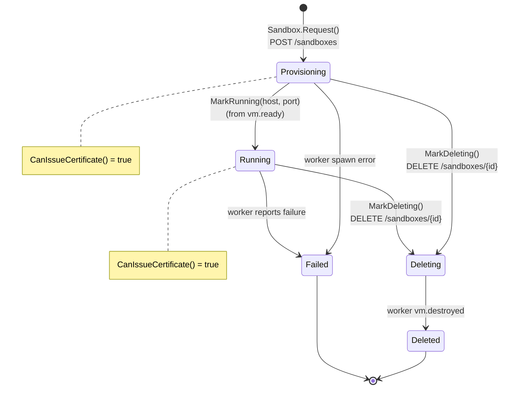
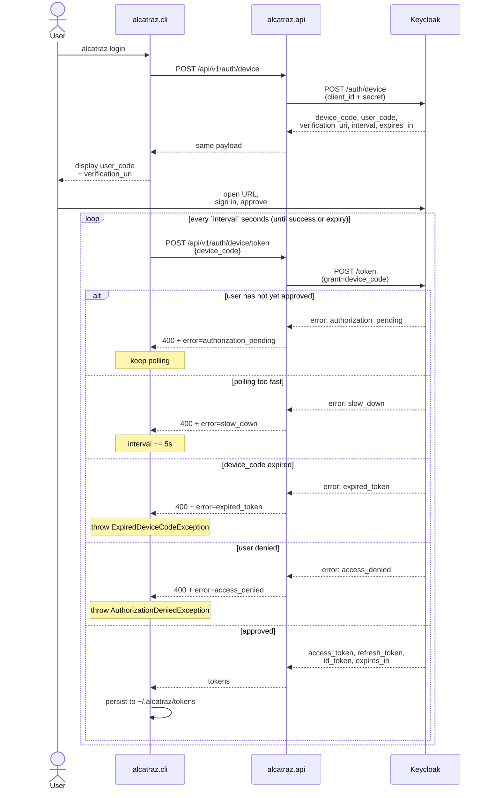

# Customer CLI & Sandboxes

## Overview

The `alcatraz` CLI is the customer-facing entry point to the Alcatraz product. Customers run it on their workstations to log in, provision a Firecracker sandbox VM, and SSH into it. This document covers the seven endpoints `alcatraz.api` exposes for that flow, the supporting domain/infrastructure, and the integration contracts with `alcatraz.worker` and the upcoming `alcatraz.gateway`.

Three concerns sit behind these endpoints:

1. **OAuth 2.0 Device Authorization Grant** — the API proxies Keycloak's device flow so the CLI never needs to know the realm or hold a client secret.
2. **Sandbox lifecycle** — a new `Sandbox` aggregate (provisioning → running → deleting → deleted/failed) whose state changes are dispatched to `alcatraz.worker` over NATS.
3. **SSH Certificate Authority** — a short-lived OpenSSH user certificate is issued for each connection, principal-scoped to a single sandbox.

The full end-to-end design (gateway, worker callback, KRL, L2 isolation) lives in `plans/customer-vm-access-ssh-ca.md` at the repo root. This doc covers the slice that ships in `alcatraz.api`.

> **Trying it locally?** `docs/local-end-to-end.md` walks through `docker compose up` → device-flow login → create sandbox → fetch SSH cert → SSH into a stand-in container that mimics the rootfs. The gateway and the real worker aren't involved in that demo; the cert pipeline is exercised against a stock `sshd`.

---

## Table of Contents

1. [Why this slice exists](#why-this-slice-exists)
2. [Endpoint reference](#endpoint-reference)
3. [Sandbox domain model](#sandbox-domain-model)
4. [Device authorization flow (Keycloak proxy)](#device-authorization-flow-keycloak-proxy)
5. [Worker integration over NATS](#worker-integration-over-nats)
6. [SSH Certificate Authority](#ssh-certificate-authority)
7. [Result → HTTP error mapping](#result--http-error-mapping)
8. [Configuration](#configuration)
9. [Database schema](#database-schema)
10. [Tests](#tests)
11. [Where to continue](#where-to-continue)

---

## Why this slice exists

When the alcatraz.api project was first added, it had Keycloak JWT bearer wired up but **nothing** the CLI needed to actually use the product end-to-end:

- No way to log in without a browser-driven password grant (CLIs are device-code-flow citizens).
- No `Sandbox` aggregate, repository, or persistence — apartments and bookings are the only existing aggregates.
- No SSH CA, no certificate signing path.

This round adds those primitives so the CLI can: device-code login → list/create/delete sandboxes → exchange a workstation pubkey for a short-lived SSH cert pinned to the sandbox handle.

---

## Endpoint reference

All routes are versioned under `api/v1/...`.

| Method | Path | Auth | Purpose |
|---|---|---|---|
| `POST` | `/api/v1/auth/device` | anonymous | Initiate device flow; returns `{device_code, user_code, verification_uri, verification_uri_complete, expires_in, interval}` |
| `POST` | `/api/v1/auth/device/token` | anonymous | Poll the IdP for a token using `{deviceCode}`; on success returns `{accessToken, refreshToken, expiresIn, tokenType, idToken}`; pending/slow_down/expired/denied → 400 + RFC 8628 error code in ProblemDetails extension `error` |
| `POST` | `/api/v1/sandboxes` | bearer | Body `{vcpus, memoryMib}`; 201 + `SandboxResponse` |
| `GET` | `/api/v1/sandboxes` | bearer | List the caller's non-deleted sandboxes |
| `GET` | `/api/v1/sandboxes/{id}` | bearer | Get one (owner-scoped; 404 on miss *or* not-yours — never leak existence) |
| `DELETE` | `/api/v1/sandboxes/{id}` | bearer | Mark `Deleting`, publish destroy; 202 |
| `POST` | `/api/v1/sandboxes/{id}/ssh-cert` | bearer | Body `{sshPublicKey}`; 200 + `{cert, validUntilUtc, gatewayHost, gatewayPort}` |

**Locations:**

- `src/Alcatraz.Api/Controllers/Auth/AuthController.cs`
- `src/Alcatraz.Api/Controllers/Sandboxes/SandboxesController.cs`

Every command flows through MediatR via `ISender` (matches the existing `BookingsController` pattern). Validation is enforced by FluentValidation validators auto-discovered by the `ValidationBehavior` MediatR pipeline behavior; failures bubble out as `ValidationException`.

---

## Sandbox domain model

A `Sandbox` is an aggregate root in the Domain layer. It carries the customer's request (vcpus, memory) plus a status, and raises domain events on every state transition that the outbox processor will dispatch later.

```csharp
// src/Alcatraz.Domain/Sandboxes/Sandbox.cs
public sealed class Sandbox : Entity
{
    public Guid OwnerUserId { get; private set; }
    public int RequestedVcpus { get; private set; }
    public int RequestedMemoryMib { get; private set; }
    public SandboxStatus Status { get; private set; }
    public DateTime CreatedOnUtc { get; private set; }
    public DateTime? DeletedOnUtc { get; private set; }

    public static Sandbox Request(Guid ownerUserId, int vcpus, int memoryMib, DateTime utcNow);
    public Result MarkDeleting(DateTime utcNow);
    public Result EnsureOwnedBy(Guid userId);          // returns SandboxErrors.NotFound on mismatch
    public bool   CanIssueCertificate();               // true while Provisioning or Running
}

// src/Alcatraz.Domain/Sandboxes/SandboxStatus.cs
public enum SandboxStatus
{
    Provisioning = 1, // set by the API on create
    Running      = 2, // reserved for the future worker callback (not set by API today)
    Deleting     = 3, // set by the API on delete
    Deleted      = 4, // reserved for terminal state after worker confirms
    Failed       = 5, // reserved for terminal state on worker failure
}
```

%% Sandbox aggregate state machine


`CanIssueCertificate()` (`Sandbox.cs`) returns `true` while in `Provisioning` or `Running` — terminal and `Deleting` states reject cert issuance with `SandboxErrors.InvalidStateForCertIssue`.

**Domain events:**

```csharp
// src/Alcatraz.Domain/Sandboxes/Events/SandboxRequestedDomainEvent.cs
public sealed record SandboxRequestedDomainEvent(
    Guid SandboxId, Guid OwnerUserId, int Vcpus, int MemoryMib) : IDomainEvent;

// src/Alcatraz.Domain/Sandboxes/Events/SandboxDeletionRequestedDomainEvent.cs
public sealed record SandboxDeletionRequestedDomainEvent(Guid SandboxId) : IDomainEvent;
```

These events ride the existing transactional outbox (see `outbox-pattern.md`). Their `INotificationHandler<>` implementations call `ISandboxEventPublisher` to fire the corresponding NATS message:

```csharp
// src/Alcatraz.Application/Sandboxes/CreateSandbox/SandboxRequestedDomainHandler.cs
internal sealed class SandboxRequestedDomainHandler(ISandboxEventPublisher publisher)
    : INotificationHandler<SandboxRequestedDomainEvent>
{
    public Task Handle(SandboxRequestedDomainEvent n, CancellationToken ct) =>
        publisher.PublishSpawnAsync(n.SandboxId, n.OwnerUserId, n.Vcpus, n.MemoryMib, ct);
}
```

**Errors** (`SandboxErrors`): `NotFound` (used for genuine misses *and* ownership mismatches — no existence leak), `AlreadyDeleting`, `AlreadyDeleted`, `InvalidStateForCertIssue`.

**Owner identity.** The aggregate stores `OwnerUserId` (local `Guid`) for FK consistency with the rest of the codebase. The Keycloak `sub` (`IdentityId`) is read from `IUserContext` only when constructing the SSH cert's `key_id` — see [SSH Certificate Authority](#ssh-certificate-authority) below.

---

## Device authorization flow (Keycloak proxy)

The CLI is a public, distributed binary that should never hold a Keycloak client secret. The API solves this by **proxying** the OAuth 2.0 Device Authorization Grant (RFC 8628). The CLI talks only to `api.alcatraz.io`; the API forwards to Keycloak using the existing `alcatraz-auth-client` confidential credential.

%% OAuth 2.0 Device Authorization Grant (RFC 8628), API-proxied


**Abstraction (Application layer):**

```csharp
// src/Alcatraz.Application/Abstractions/Authentication/IDeviceAuthorizationClient.cs
public interface IDeviceAuthorizationClient
{
    Task<Result<DeviceAuthorizationResponse>> InitiateAsync(CancellationToken ct = default);
    Task<Result<DeviceTokenResponse>> ExchangeAsync(string deviceCode, CancellationToken ct = default);
}
```

**Implementation (Infrastructure):**

```csharp
// src/Alcatraz.Infrastructure/Authentication/KeycloakDeviceAuthorizationClient.cs
internal sealed class KeycloakDeviceAuthorizationClient(
    HttpClient httpClient,
    IOptions<KeycloakOptions> keycloakOptions,
    ILogger<KeycloakDeviceAuthorizationClient> logger
) : IDeviceAuthorizationClient
{
    private const string DeviceCodeGrantType = "urn:ietf:params:oauth:grant-type:device_code";

    public async Task<Result<DeviceAuthorizationResponse>> InitiateAsync(CancellationToken ct = default)
    {
        // form-encoded POST to keycloakOptions.DeviceAuthorizationUrl with client_id+client_secret
    }

    public async Task<Result<DeviceTokenResponse>> ExchangeAsync(string deviceCode, CancellationToken ct = default)
    {
        // form-encoded POST to keycloakOptions.TokenUrl with grant_type=urn:ietf:params:oauth:grant-type:device_code
        // maps Keycloak's `error` JSON field to one of:
        //   authorization_pending → DeviceAuthErrors.AuthorizationPending
        //   slow_down            → DeviceAuthErrors.SlowDown
        //   expired_token        → DeviceAuthErrors.ExpiredToken
        //   access_denied        → DeviceAuthErrors.AccessDenied
        //   anything else        → DeviceAuthErrors.ExchangeFailed
    }
}
```

**Stable error codes** that the controller turns into ProblemDetails:

```csharp
// src/Alcatraz.Application/Abstractions/Authentication/IDeviceAuthorizationClient.cs
public static class DeviceAuthErrors
{
    public static readonly Error AuthorizationPending = new("Auth.Device.AuthorizationPending", ...);
    public static readonly Error SlowDown            = new("Auth.Device.SlowDown",            ...);
    public static readonly Error ExpiredToken        = new("Auth.Device.ExpiredToken",        ...);
    public static readonly Error AccessDenied        = new("Auth.Device.AccessDenied",        ...);
    public static readonly Error InitiationFailed    = new("Auth.Device.InitiationFailed",    ...);
    public static readonly Error ExchangeFailed      = new("Auth.Device.ExchangeFailed",      ...);
}
```

The controller renders any `Auth.Device.*` failure as **HTTP 400** with a ProblemDetails body whose `error` extension carries the snake-cased RFC 8628 code (`authorization_pending`, etc.). The CLI polls `/auth/device/token` on the interval Keycloak returned and treats `authorization_pending` / `slow_down` as keep-trying signals.

**Keycloak prerequisite.** The `alcatraz-auth-client` realm client must have **OAuth 2.0 Device Authorization Grant** enabled. Reusing this client (rather than creating a separate public CLI client) is intentional — the API holds the secret server-side, so a confidential client is fine.

---

## Worker integration over NATS

`alcatraz.worker` already runs a NATS subscriber for `vm.spawn` (see `alcatraz.worker/internal/messaging/config.go:16`). The API uses the existing payload shape so the contract is symmetric:

```go
// alcatraz.worker/internal/vm/config.go:50-55
type CreateVirtualMachineInput struct {
    ID         string `json:"id,omitempty"`
    VCPUs      int    `json:"vcpus,omitempty"`
    MemoryMib  int    `json:"memory_mib,omitempty"`
    KernelArgs string `json:"kernel_args,omitempty"`
}
```

**Abstraction (Application layer):**

```csharp
// src/Alcatraz.Application/Abstractions/Messaging/ISandboxEventPublisher.cs
public interface ISandboxEventPublisher
{
    Task PublishSpawnAsync(Guid sandboxId, Guid ownerUserId, int vcpus, int memoryMib, CancellationToken ct = default);
    Task PublishDestroyAsync(Guid sandboxId, CancellationToken ct = default);
}
```

**Implementation (Infrastructure):**

```csharp
// src/Alcatraz.Infrastructure/Messaging/NatsSandboxEventPublisher.cs
internal sealed class NatsSandboxEventPublisher(
    NatsConnectionFactory connectionFactory,
    IOptions<NatsOptions> natsOptions,
    ILogger<NatsSandboxEventPublisher> logger
) : ISandboxEventPublisher
{
    // Spawn payload: { id, vcpus, memory_mib, customer_id }
    // Destroy payload: { id }
    // Both serialized with JsonNamingPolicy.SnakeCaseLower so they match the worker's Go struct.
}
```

**Subjects** (configurable, see `appsettings.Development.json`):

| Direction | Subject | Payload | Subscriber |
|---|---|---|---|
| API → Worker | `vm.spawn` | `{ id, vcpus, memory_mib, customer_id }` | existing `alcatraz.worker` queue group |
| API → Worker | `vm.destroy` | `{ id }` | **not yet subscribed** — forward contract for the worker to honour |

`customer_id` carries the local `OwnerUserId.ToString()`. The worker's Go struct uses `omitempty`, so the extra field is safe even though the worker ignores it today.

The NATS connection is a singleton wrapped by `NatsConnectionFactory`; lazy-connected and reused across publishes:

```csharp
// src/Alcatraz.Infrastructure/Messaging/NatsConnectionFactory.cs
internal sealed class NatsConnectionFactory(IOptions<NatsOptions> natsOptions) : IAsyncDisposable
{
    public async Task<NatsConnection> GetConnectionAsync(CancellationToken ct = default) { ... }
}
```

The publisher itself is invoked **only after the DB transaction has committed**, because the domain handlers run inside `ProcessOutboxMessagesJob` (see `outbox-pattern.md`). This gives "saved-to-DB-and-published-once" semantics rather than the dual-write antipattern.

---

## SSH Certificate Authority

The cert-issuing endpoint is a thin wrapper around `ssh-keygen -s`. We deliberately do **not** hand-roll the OpenSSH user-certificate wire format — the tradeoff is one external binary in the API container vs. ~150 LoC of brittle byte-exact serialization that must be byte-for-byte compatible with stock OpenSSH clients.

**Abstraction (Application layer):**

```csharp
// src/Alcatraz.Application/Abstractions/Security/ISshCertificateAuthority.cs
public interface ISshCertificateAuthority
{
    Task<Result<IssuedSshCertificate>> IssueAsync(
        string sshPublicKeyOpenSsh,
        string principal,
        TimeSpan ttl,
        string keyId,
        DateTime utcNow,
        CancellationToken ct = default);
}

public sealed record IssuedSshCertificate(string CertOpenSsh, DateTime ValidAfterUtc, DateTime ValidUntilUtc);
```

**Implementation (Infrastructure):**

```csharp
// src/Alcatraz.Infrastructure/Security/SshKeygenCertificateAuthority.cs
internal sealed class SshKeygenCertificateAuthority(
    IOptions<SshCertificateAuthorityOptions> options,
    ILogger<SshKeygenCertificateAuthority> logger
) : ISshCertificateAuthority
{
    public async Task<Result<IssuedSshCertificate>> IssueAsync(...)
    {
        // 1. Write `sshPublicKeyOpenSsh` to a temp file ending in .pub
        // 2. Run: ssh-keygen -s <PrivateKeyPath> -I <keyId> -n <principal> -V +<ttlMinutes>m <tmp>.pub
        // 3. Read <tmp>-cert.pub, return its contents
        // 4. Always delete the temp directory in `finally`
        // 5. Non-zero exit → Result.Failure(SshCertificateErrors.SigningFailed) with stderr logged
    }
}
```

**Cert parameters** (set by `IssueSshCertificateCommandHandler`):

- `principal` = the sandbox UUID as a string. The VM's `sshd` will only accept this cert if `/etc/ssh/auth_principals/al` contains the same UUID (worker-side enforcement, see SSH-CA plan §3 step 3).
- `ttl` = 24 hours.
- `keyId` = `{IdentityId}:{SandboxId}:{UnixTs}`. Carries the Keycloak `sub` for accounting / KRL revocation. This is the **only** place the Keycloak identity ID enters the cert flow.
- The customer's pubkey is passed by value through `ssh-keygen` and is **never persisted** in the API DB.

**Issue flow (Application layer):**

```csharp
// src/Alcatraz.Application/Sandboxes/IssueSshCertificate/IssueSshCertificateCommandHandler.cs
public async Task<Result<SshCertificateResponse>> Handle(IssueSshCertificateCommand request, CancellationToken ct)
{
    var sandbox = await sandboxRepository.GetByIdAsync(request.SandboxId, ct);
    if (sandbox is null)                              return Result.Failure<...>(SandboxErrors.NotFound);
    if (sandbox.EnsureOwnedBy(userContext.UserId).IsFailure) return Result.Failure<...>(SandboxErrors.NotFound);
    if (!sandbox.CanIssueCertificate())              return Result.Failure<...>(SandboxErrors.InvalidStateForCertIssue);

    var keyId = $"{userContext.IdentityId}:{sandbox.Id}:{unixSeconds}";
    var issued = await certificateAuthority.IssueAsync(
        request.SshPublicKey, sandbox.Id.ToString(), TimeSpan.FromHours(24), keyId, utcNow, ct);

    if (issued.IsFailure) return Result.Failure<...>(issued.Error);

    return new SshCertificateResponse(
        issued.Value.CertOpenSsh,
        issued.Value.ValidUntilUtc,
        gatewayOptions.Host,
        gatewayOptions.Port);
}
```

**Validator** rejects pubkeys whose prefix is not one of `ssh-ed25519`, `ecdsa-sha2-nistp{256,384,521}`, or `ssh-rsa`. Full structural parsing is delegated to `ssh-keygen` itself — if the customer sends a malformed key, ssh-keygen fails and we return `SshCertificateErrors.SigningFailed`.

---

## Result → HTTP error mapping

The existing `BookingsController` returns `StatusCode(500, error)` on any failure, which is too coarse for these endpoints (404 vs 403 vs 409 vs 400 matter for the CLI). We added a small helper used by the new controllers; the existing controllers are left alone.

```csharp
// src/Alcatraz.Api/Extensions/ResultExtensions.cs
internal static class ResultExtensions
{
    public static IActionResult ToFailureActionResult(this Error error)
    {
        // SandboxErrors.NotFound                                        → 404
        // DeviceAuthErrors.* (RFC 8628 polling errors + transport)      → 400 + ProblemDetails extension { error = "<rfc_code>" }
        // SshCertificateErrors.InvalidPublicKey                         → 400
        // SshCertificateErrors.SigningFailed                            → 500
        // SandboxErrors.AlreadyDeleting/AlreadyDeleted/InvalidState...  → 409
        // anything else                                                 → 500
    }
}
```

The CLI distinguishes "keep polling" from "give up" by reading the ProblemDetails `error` field on the device token endpoint:

```jsonc
// 400 Bad Request
{
  "title": "device_authorization_error",
  "detail": "Authorization has not yet completed",
  "status": 400,
  "error": "authorization_pending"   // <-- parse this, sleep `interval`, retry
}
```

---

## Configuration

New configuration sections in `appsettings.Development.json`:

```jsonc
"Keycloak": {
  // existing keys …
  "DeviceAuthorizationUrl": "http://alcatraz-idp:8080/realms/alcatraz/protocol/openid-connect/auth/device"
},
"Nats": {
  "Url": "nats://alcatraz-nats:4222",
  "SpawnSubject": "vm.spawn",
  "DestroySubject": "vm.destroy"
},
"Ssh": {
  "CA": {
    "PrivateKeyPath": "/run/alcatraz-ca/alcatraz_ca",
    "DefaultTtlHours": 24,
    "SshKeygenPath": "ssh-keygen"
  }
},
"Gateway": {
  "Host": "ssh.alcatraz.io",
  "Port": 443
}
```

The compose file overrides `Ssh:CA:PrivateKeyPath` and `Nats:Url` per-service via env vars (`Ssh__CA__PrivateKeyPath`, `Nats__Url`) so the appsettings value is just a sensible default for the local-compose layout.

The `Ssh:CA:PrivateKeyPath` must point at an OpenSSH-format Ed25519 private key (`ssh-keygen -t ed25519 -f alcatraz_ca -N ""`). The compose stack generates one automatically via the `alcatraz-ca-init` service into the shared `alcatraz_ca` volume on first boot, and chowns it to UID 1654 (the `app` user inside `mcr.microsoft.com/dotnet/aspnet:8.0`) — OpenSSH refuses to use a private key with group/world-readable bits, so the key stays `0600` and ownership is what changes. v1 reads the key from a path; KMS/Vault integration is deferred (see [Where to continue](#where-to-continue)).

The `alcatraz-auth-client` Keycloak client must have **OAuth 2.0 Device Authorization Grant** enabled in the realm admin UI for the device flow to function.

---

## Database schema

A single new table:

```
sandboxes:
  id                    uuid PRIMARY KEY
  owner_user_id         uuid NOT NULL REFERENCES users(id) ON DELETE CASCADE
  requested_vcpus       int  NOT NULL
  requested_memory_mib  int  NOT NULL
  status                int  NOT NULL  -- SandboxStatus enum
  created_on_utc        timestamptz NOT NULL
  deleted_on_utc        timestamptz NULL
INDEX ix_sandboxes_owner_user_id ON sandboxes(owner_user_id);
INDEX ix_sandboxes_status        ON sandboxes(status);
```

Migration: `src/Alcatraz.Infrastructure/Migrations/20260508122535_Add_Sandboxes.cs`.

**No customer pubkeys, no cert material, no tokens** are persisted. The API is stateless with respect to SSH keys — the CA private key is the only key it holds, and only at runtime. This satisfies the "no persisted pubkey" constraint from the SSH-CA plan.

The `Sandbox` repository derives from the existing generic `Repository<T>` base — no custom queries; the list/get views use Dapper SQL directly (matches the `GetBookingQueryHandler` pattern).

---

## Tests

169 tests across the four existing test projects, all green:

| Project | Count | Coverage |
|---|---|---|
| `Alcatraz.Domain.UnitTests` | 12 | `SandboxTests` — request/markDeleting/ownership/canIssueCertificate state transitions and event raising |
| `Alcatraz.Application.UnitTests` | 116 | All command/query handlers, FluentValidation rules per validator, RFC 8628 error propagation, `SandboxRequestedDomainHandler`/`SandboxDeletionRequestedDomainHandler` invoking the publisher, NATS payload serialization shape (snake_case keys present) |
| `Alcatraz.Application.IntegrationTests` | 5 | `CreateSandboxIntegrationTests` — sandbox row + outbox row written in the same transaction (real Postgres via Testcontainers) |
| `Alcatraz.Api.FunctionalTests` | 36 | `SandboxesEndpointsTests` (happy + ownership-mismatch + invalid-token + unauth across all 5 sandbox routes); `DeviceFlowEndpointsTests` (initiate + happy-path exchange + each RFC 8628 polling error returned as 400 with extension); `SshKeygenCertificateAuthorityTests` (real `ssh-keygen` end-to-end, then `ssh-keygen -L -f` to verify principal, key ID, and validity window) |

The `DeviceFlowEndpointsTests.Factory` boots `WebApplicationFactory<Program>` in `Production` environment (skipping `ApplyMigrations` / `SeedData`) so it can run without Postgres — `IDeviceAuthorizationClient` is substituted with NSubstitute. The other functional tests use the existing `FunctionalTestWebAppFactory` with real Keycloak/Postgres/Redis Testcontainers.

---

## Where to continue

Items deliberately deferred this round, with the order they should land for the full SSH-CA plan to be operational:

1. **Worker → API endpoint callback.** Today the sandbox stays `Provisioning` forever — the worker boots the VM but never reports `(worker_host, vm_ip, ssh_user, ssh_port, status=Running)` back. Recommended shape: a side-table `sandbox_endpoints` keyed by `sandbox_id`, populated via a NATS reply or a dedicated `vm.endpoint.report` subject. Keep the aggregate stable; don't bolt these columns onto `sandboxes` directly.

2. **Worker subscriber for `vm.destroy`.** The API publishes destroy messages but no Go-side subscriber exists yet. Add to `alcatraz.worker/internal/messaging/` mirroring the `vm.spawn` subscriber.

3. **`alcatraz.gateway` implementation.** Public TLS termination on `:443`, SSH cert verification against the CA pubkey, KRL polling, routing to `(worker_host, vm_ip)` from the API's endpoint registry. None of this lives in `alcatraz.api`; it's a new service.

4. **KRL endpoint and CA rotation.** `GET /api/v1/sandboxes/krl` returning a CA-signed key revocation list, plus an admin endpoint to add a `key_id` to it. Required for sub-TTL revocation. CA rotation needs a dual-CA window (VMs trust both old and new pubkeys during overlap).

5. **CA key encryption at rest.** `SshKeygenCertificateAuthority` reads the CA from a config-supplied path. Wrap that with an `ISshCaKeyProvider` and wire AWS KMS / Vault transit decryption at startup. Until then, the path-based approach assumes OS-level secret management (Docker secrets, sealed volumes).

6. **NATS publish-failure handling.** `ProcessOutboxMessagesJob` marks errored messages as processed (with the error stored), so a hard NATS broker outage at publish time loses the spawn signal without retry. Either add a retry-on-error sweep job, or buffer publish acks in `NatsSandboxEventPublisher`. Flag tracked in `outbox-pattern.md` § "At-least-once delivery".

7. **Cert audit trail.** Cert issuances are logged via `ILogger`, not persisted. If compliance demands a tamper-evident trail, add an `ssh_certificate_issuances` table populated by a new domain event raised in `IssueSshCertificateCommandHandler`.

8. **Public Keycloak CLI client.** The current implementation reuses the confidential `alcatraz-auth-client`; the secret stays server-side because the API proxies the device flow. If a future client (browser-side, IDE extension) needs to talk to Keycloak directly, mint a separate **public** `alcatraz-cli` client and expose its discovery URL via a new `/api/v1/auth/discovery` endpoint.
