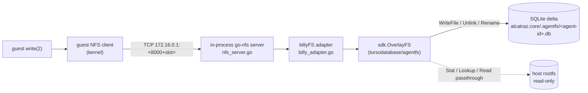

# Editing files inside the sandbox with AgentFS

Each VM boots with `root=/dev/nfs` pointing at an in-process NFSv3 server that the
worker runs on the host bridge gateway IP. That NFS export is not the host's
rootfs directly — it is an AgentFS *overlay* that stitches a read-only view of
`alcatraz.core/rootfs` together with a per-VM SQLite delta at
`alcatraz.core/.agentfs/<agent-id>.db`.

This doc explains where a guest-side write actually lands, how to inspect the
audit log AgentFS keeps, and the options you have for moving changes back out.

## The write path

When the guest edits `/etc/foo.conf` (or anything else under `/`), the request
travels:

%% Guest write → NFS → AgentFS overlay → SQLite delta (base rootfs is read-only)


Key points worth knowing when reading or debugging:

- **The host rootfs is never written.** `HostBase` only implements
  `Stat`/`Lookup`/`Readdir`/`ReadFile`/`Readlink`. Every mutating op
  (`WriteFile`, `Unlink`, `Rmdir`, `Rename`, `Symlink`, `MkdirAll`) is
  serviced exclusively by the SQLite overlay. The base layer at
  `../alcatraz.core/rootfs` is treated as immutable — the worker only checks
  it via `RootfsStamp` to decide whether the delta DB is still compatible.
- **Open caches the whole file in memory.** `billyFile` reads the file's
  current bytes on `OpenFile` (unless `O_TRUNC`) into an in-memory buffer,
  serves all reads/writes against that buffer, and on `Close` flushes the
  whole thing back via `overlay.WriteFile` if `dirty` was set. This is
  documented as v1 perf debt — large file edits are O(file size) per close.
- **First touch promotes a base file into the overlay.** A read-only base
  file becomes a regular overlay row the moment the guest's first dirty
  `Close` calls `WriteFile`. After that, all reads come from the overlay.
- **Schema lives in the same DB as the audit log and KV store.** AgentFS's
  SPEC defines three areas in one SQLite file: `tool_calls` (audit), the
  virtual filesystem (`fs_inode`/`fs_dentry`/`fs_data`/`fs_symlink`), and
  `kv_store`. Filesystem edits land in the `fs_*` tables.
- **Lifecycle.** `OpenAndServe` runs once at VM start
  (`internal/vm/spawn.go`). The overlay handle is held until VM exit, then
  `NFSServer.Kill` closes the listener and `OverlayHandle.Close` drops the
  AgentFS connection. The DB file remains on disk so the next spawn with
  the same `agent_id` reuses it (provided the rootfs stamp still matches).

## Locating the right database

Each VM has a stable `agent_id` (the `id` field on the spawn request — auto-
generated UUID if omitted). The worker logs it on spawn:

```
VM agentfs overlay ready agent_id=<uuid> ...
```

For that agent, the relevant files on the host are:

| File | Purpose |
|---|---|
| `alcatraz.core/.agentfs/<agent-id>.db` | The SQLite overlay (filesystem + audit + KV) |
| `alcatraz.core/.agentfs/<agent-id>.db-wal` | SQLite WAL — present while the worker has the DB open |
| `alcatraz.core/.agentfs/<agent-id>.db-shm` | SQLite shared memory — present while open |
| `alcatraz.core/.agentfs/<agent-id>.base-stamp` | Hash of `rootfs/etc/alcatraz-release` at init time |

If the stamp file disagrees with the current rootfs stamp on next spawn,
`PrepareOverlay` deletes all four files and reinitialises from scratch — so
**any unsynced edits are lost on a base rootfs change**. Persist anything
worth keeping before rebuilding the rootfs.

## Inspecting changes from the host

The `agentfs` CLI reads the same SQLite file the worker writes to. As long as
the VM is shut down (or you accept dirty reads against the WAL) you can
inspect the overlay directly.

```bash
cd alcatraz.core/.agentfs

# List all entries the overlay sees at /etc (overlay merges base + delta).
agentfs fs <agent-id> ls /etc

# Show file contents through the overlay.
agentfs fs <agent-id> cat /etc/foo.conf

# Show just the delta — what the guest changed vs. the base rootfs.
agentfs diff <agent-id>
```

You can also pass a path instead of an id:

```bash
agentfs fs ./<agent-id>.db ls /
```

Schema-level inspection works with any sqlite client:

```bash
sqlite3 alcatraz.core/.agentfs/<agent-id>.db '.tables'
sqlite3 alcatraz.core/.agentfs/<agent-id>.db 'SELECT path FROM fs_dentry LIMIT 20;'
```

(See `agentfs/SPEC.md` for the full table layout.)

## Checking the audit database

AgentFS keeps an insert-only `tool_calls` table in every overlay DB. The
worker itself does not write to it — it is populated by anything that runs
through the AgentFS SDK with audit enabled (e.g. an agent invoking tools
inside the sandbox). Treat absence as "no auditable activity recorded for
this agent yet," not as an error.

The tidy way:

```bash
# Newest 50 tool calls.
agentfs timeline <agent-id> --limit 50

# Only failures.
agentfs timeline <agent-id> --status error

# Filter by tool name.
agentfs timeline <agent-id> --filter read_file

# JSON for piping into jq.
agentfs timeline <agent-id> --format json | jq '.[] | {name, duration_ms, error}'
```

The raw way (useful when you want aggregates the CLI doesn't expose):

```bash
sqlite3 alcatraz.core/.agentfs/<agent-id>.db \
  "SELECT name, COUNT(*) calls, AVG(duration_ms) avg_ms,
          SUM(error IS NOT NULL) failures
   FROM tool_calls GROUP BY name ORDER BY calls DESC;"
```

Schema (per `agentfs/SPEC.md`):

```sql
CREATE TABLE tool_calls (
  id INTEGER PRIMARY KEY AUTOINCREMENT,
  name TEXT NOT NULL,
  parameters TEXT,        -- JSON
  result TEXT,            -- JSON, NULL on error
  error TEXT,             -- NULL on success
  started_at INTEGER NOT NULL,    -- unix seconds
  completed_at INTEGER NOT NULL,
  duration_ms INTEGER NOT NULL
);
```

The table is append-only by spec — never `UPDATE` or `DELETE` rows; archive
to a separate table if you need to prune.

## Syncing changes back

There is **no automatic sync from the overlay to the host rootfs**. The base
layer is read-only by design, and nothing in the worker copies guest edits
out at shutdown. If you want changes to leave the SQLite delta you have
two options.

### 1. Pull individual files out via the CLI

Cheapest and works offline. Useful for grabbing a config file or a build
artifact:

```bash
agentfs fs <agent-id> cat /workspace/build/output.tar.gz \
  > /tmp/output.tar.gz
```

`agentfs diff <agent-id>` lists everything that differs from the base, which
is the natural starting point for "what do I need to copy out?"

### 2. Mount the overlay on the host and rsync

When you want a tree, not single files:

```bash
# Pick a free dir.
mkdir -p /tmp/overlay-<agent-id>

# Mount the overlay via FUSE. Runs in the foreground.
agentfs mount <agent-id> /tmp/overlay-<agent-id>

# (in another terminal) copy whatever subset you want.
rsync -a /tmp/overlay-<agent-id>/workspace/ ./out/

# Stop the FUSE mount when done.
fusermount -u /tmp/overlay-<agent-id>
```

You can also use `agentfs exec <agent-id> -- <command>` to run a single
command with the overlay mounted to a tempdir — handy for `tar`-ing a
subtree without managing the mount yourself.

**Don't run this against a DB that the worker still has open.** Stop the VM
(or the worker) first; otherwise the FUSE mount and the in-process server
race for the same SQLite file.

### What about merging back into `alcatraz.core/rootfs`?

That direction isn't supported and isn't planned. The base rootfs is built
out-of-band by `alcatraz.core/build-rootfs.sh`; if a guest change should
become part of every future VM, fold it into the rootfs build inputs and
rebuild. On rebuild, the stamp changes and `PrepareOverlay` will discard
existing deltas — see the warning in [Locating the right database](#locating-the-right-database).
