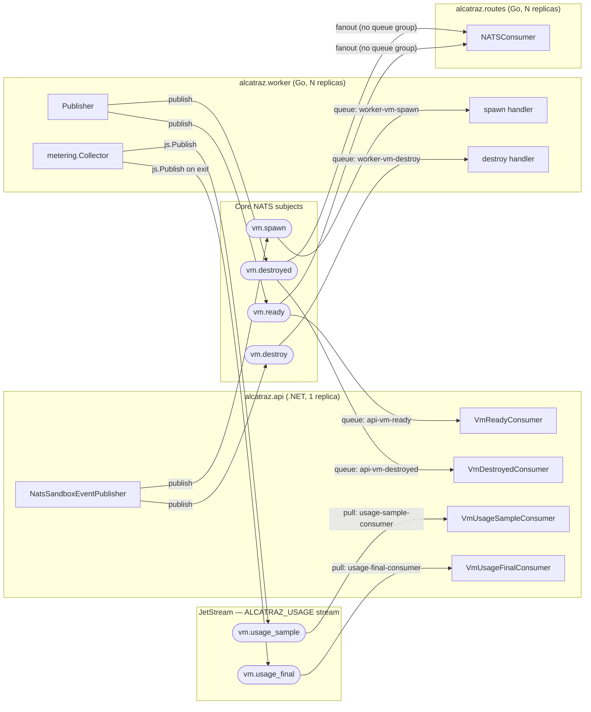
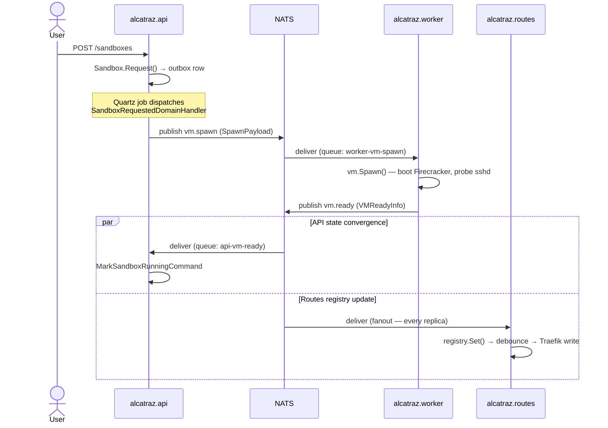
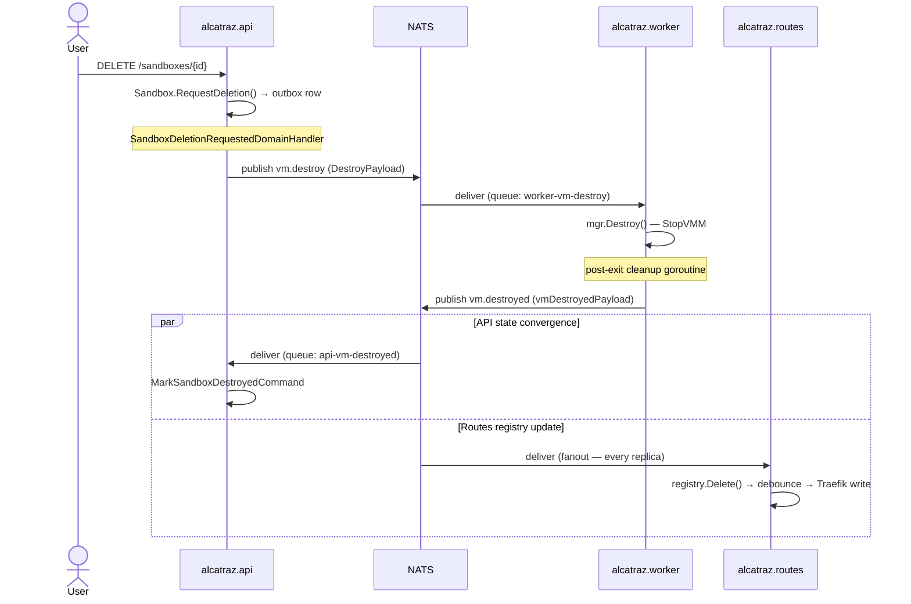
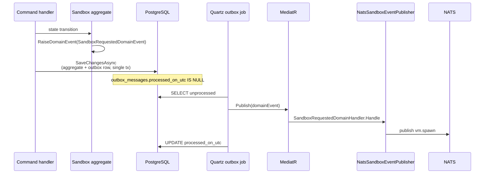

# NATS Broker Reference

This document is the canonical reference for Alcatraz's NATS messaging surface: the broker topology, every producer and consumer, the message contracts on the wire, and the operational characteristics that follow from the current setup.

It complements rather than replaces:

- [`../README.md`](../README.md) — high-level lifecycle overview (sections "End-to-end request lifecycle" and "API ↔ Worker integration (NATS)").
- [`../plans/architecture.md`](../plans/architecture.md) — architecture summary including the NATS subjects table.
- [`../alcatraz.api/docs/outbox-pattern.md`](../alcatraz.api/docs/outbox-pattern.md) — full detail on the transactional outbox that produces `vm.spawn` / `vm.destroy`.
- [`adr/0001-core-nats-over-jetstream.md`](adr/0001-core-nats-over-jetstream.md) — why lifecycle subjects run on core NATS, and what trade-offs that locks in.
- [`adr/0012-jetstream-for-billing-subjects.md`](adr/0012-jetstream-for-billing-subjects.md) — why the two billing subjects ride JetStream while lifecycle stays on core NATS.
- [`billing-metrics.md`](billing-metrics.md) — what the billing pipeline measures and how it's consumed downstream.

## 1. Overview

Alcatraz uses **core NATS** as the async backbone between three services for the VM lifecycle, and a single **JetStream** stream for billing/usage events. Wire format is **plain JSON with `snake_case` field names**; there is no envelope, correlation header, or schema version embedded in the message — the subject *is* the type.

| Service           | Language    | Role in messaging                                                |
| ----------------- | ----------- | ---------------------------------------------------------------- |
| `alcatraz.api`    | .NET 8 (C#) | Publishes commands; consumes lifecycle + usage events            |
| `alcatraz.worker` | Go          | Consumes commands; publishes lifecycle + usage events            |
| `alcatraz.routes` | Go          | Consumes lifecycle events only (fanout, no queue group)          |

Six subjects in total. Four are core NATS pub/sub (lifecycle: `vm.spawn`, `vm.destroy`, `vm.ready`, `vm.destroyed`); two are JetStream durable-consumer subjects (billing: `vm.usage_sample`, `vm.usage_final`). The split is deliberate — see [ADR-0001](adr/0001-core-nats-over-jetstream.md) and [ADR-0012](adr/0012-jetstream-for-billing-subjects.md) for why.

The broker runs `nats:2.10` with `-js -sd /data/jetstream -m 8222` (`docker-compose.yml:98`). The `ALCATRAZ_USAGE` stream and its two pull consumers are declared idempotently at API startup by `JetStreamProvisioningHostedService`. JetStream state is durable via the `nats_jetstream` named volume.

## 2. Topology

Asymmetry to notice: command subjects (`vm.spawn`, `vm.destroy`) load-balance across worker replicas via queue groups. Lifecycle subjects (`vm.ready`, `vm.destroyed`) load-balance across API replicas via queue groups *but* fan out to every routes replica — each gateway needs the full registry. Billing subjects use JetStream durable pull consumers with explicit ack-after-DB-commit, so the API can be down without dropping samples.

## 3. Lifecycle sequence diagrams

### Spawn flow

### Destroy flow

## 4. Producers

| Service           | Subject           | Delivery   | Source                                                                                          | Trigger                                                              | Payload type           |
| ----------------- | ----------------- | ---------- | ----------------------------------------------------------------------------------------------- | -------------------------------------------------------------------- | ---------------------- |
| `alcatraz.api`    | `vm.spawn`        | core NATS  | `alcatraz.api/src/Alcatraz.Infrastructure/Messaging/NatsSandboxEventPublisher.cs:22`            | Outbox handler for `SandboxRequestedDomainEvent`                     | `SpawnPayload`         |
| `alcatraz.api`    | `vm.destroy`      | core NATS  | `alcatraz.api/src/Alcatraz.Infrastructure/Messaging/NatsSandboxEventPublisher.cs:40`            | Outbox handler for `SandboxDeletionRequestedDomainEvent`             | `DestroyPayload`       |
| `alcatraz.worker` | `vm.ready`        | core NATS  | `alcatraz.worker/internal/messaging/publisher.go`                                               | Post-boot in `vm.Spawn()` after sshd probe succeeds                  | `VMReadyInfo`          |
| `alcatraz.worker` | `vm.destroyed`    | core NATS  | `alcatraz.worker/internal/messaging/publisher.go`                                               | Post-exit cleanup goroutine after Firecracker process terminates     | `vmDestroyedPayload`   |
| `alcatraz.worker` | `vm.usage_sample` | JetStream  | `alcatraz.worker/internal/messaging/publisher.go` (via `metering.Collector`)                    | 60 s ticker per running VM                                           | `metering.SamplePayload` |
| `alcatraz.worker` | `vm.usage_final`  | JetStream  | `alcatraz.worker/internal/messaging/publisher.go` (via `metering.Collector.Stop`)               | Once on VM exit, before `vm.destroyed` is published                  | `metering.FinalPayload`  |

Core-NATS publishes call `nc.Publish` followed by `nc.Flush` to push the message synchronously. JetStream publishes go through `js.Publish` with a `Nats-Msg-Id` header for server-side dedup; both methods await PubAck so the worker only proceeds once the broker has durably stored the message.

## 5. Consumers

| Service           | Subject           | Delivery   | Group / consumer                  | Handler                                                                                | Effect                                                       |
| ----------------- | ----------------- | ---------- | --------------------------------- | -------------------------------------------------------------------------------------- | ------------------------------------------------------------ |
| `alcatraz.worker` | `vm.spawn`        | core NATS  | queue `worker-vm-spawn`           | `alcatraz.worker/cmd/alcatraz-worker/main.go`                                          | Invokes `vm.Spawn()` — boots a Firecracker VM                |
| `alcatraz.worker` | `vm.destroy`      | core NATS  | queue `worker-vm-destroy`         | `alcatraz.worker/cmd/alcatraz-worker/main.go`                                          | Invokes `mgr.Destroy()` — stops the Firecracker process      |
| `alcatraz.api`    | `vm.ready`        | core NATS  | queue `api-vm-ready`              | `alcatraz.api/src/Alcatraz.Infrastructure/Messaging/VmReadyConsumer.cs:26`             | Dispatches `MarkSandboxRunningCommand` via MediatR           |
| `alcatraz.api`    | `vm.destroyed`    | core NATS  | queue `api-vm-destroyed`          | `alcatraz.api/src/Alcatraz.Infrastructure/Messaging/VmDestroyedConsumer.cs:26`         | Dispatches `MarkSandboxDestroyedCommand` via MediatR         |
| `alcatraz.routes` | `vm.ready`        | core NATS  | **none (fanout)**                 | `alcatraz.routes/internal/registry/nats.go:71`                                         | `registry.Set()` → debounced Traefik dynamic-config write    |
| `alcatraz.routes` | `vm.destroyed`    | core NATS  | **none (fanout)**                 | `alcatraz.routes/internal/registry/nats.go:87`                                         | `registry.Delete()` → debounced Traefik dynamic-config write |
| `alcatraz.api`    | `vm.usage_sample` | JetStream  | pull `usage-sample-consumer`      | `alcatraz.api/src/Alcatraz.Infrastructure/Messaging/VmUsageSampleConsumer.cs`          | Dispatches `RecordSandboxUsageSampleCommand`; ack-after-commit |
| `alcatraz.api`    | `vm.usage_final`  | JetStream  | pull `usage-final-consumer`       | `alcatraz.api/src/Alcatraz.Infrastructure/Messaging/VmUsageFinalConsumer.cs`           | Dispatches `MarkSandboxUsageRecordedCommand`; ack-after-commit |

Worker subscriptions use `ChanQueueSubscribe` with a 64-message buffered channel (`alcatraz.worker/internal/messaging/subscriber.go:42`); if the handler stalls, the standard NATS slow-consumer behavior applies. Core-NATS API consumers use `await foreach` over `connection.SubscribeAsync<byte[]>` and process messages serially per replica. JetStream consumers use `consumer.ConsumeAsync<byte[]>` and explicitly `AckAsync` (or `NakAsync`) per message — see [ADR-0012](adr/0012-jetstream-for-billing-subjects.md).

Queue groups follow the convention **`<service>-<subject-with-dots-as-dashes>`**, declared in code at:

- `alcatraz.worker/internal/messaging/config.go` (`worker-vm-spawn`, `worker-vm-destroy`)
- `alcatraz.api/src/Alcatraz.Infrastructure/Messaging/NatsOptions.cs` (`api-vm-ready`, `api-vm-destroyed`)

JetStream consumer names are declared at `alcatraz.api/src/Alcatraz.Infrastructure/Messaging/NatsOptions.cs` (`usage-sample-consumer`, `usage-final-consumer`) and created at API startup by `JetStreamProvisioningHostedService`.

## 6. Message contracts

Serialization is `System.Text.Json` with `JsonNamingPolicy.SnakeCaseLower` on the C# side and Go struct tags on the worker side. There is **no envelope**; the body is the payload object directly.

### 6.1 `vm.spawn` — API → Worker

Producer record: `SpawnPayload` at `alcatraz.api/src/Alcatraz.Infrastructure/Messaging/NatsSandboxEventPublisher.cs:59`. Consumed by an inline anonymous struct in `alcatraz.worker/cmd/alcatraz-worker/main.go:92` (deserialized into `vm.CreateVirtualMachineInput`).

| Field         | Type   | Meaning                                          |
| ------------- | ------ | ------------------------------------------------ |
| `id`          | string | Sandbox UUID (server-generated)                  |
| `vcpus`       | int    | Requested vCPUs                                  |
| `memory_mib`  | int    | Requested memory in MiB                          |
| `customer_id` | string | Owner user UUID                                  |

### 6.2 `vm.destroy` — API → Worker

Producer record: `DestroyPayload` at `alcatraz.api/src/Alcatraz.Infrastructure/Messaging/NatsSandboxEventPublisher.cs:61`. Consumed by an inline anonymous struct at `alcatraz.worker/cmd/alcatraz-worker/main.go:118`.

| Field | Type   | Meaning           |
| ----- | ------ | ----------------- |
| `id`  | string | Sandbox UUID      |

### 6.3 `vm.ready` — Worker → API + Routes

Producer struct: `VMReadyInfo` at `alcatraz.worker/internal/messaging/publisher.go:41`. API-side mirror: `VmReadyPayload` at `alcatraz.api/src/Alcatraz.Infrastructure/Messaging/VmReadyConsumer.cs:116`. Routes only reads three fields; see `alcatraz.routes/internal/registry/nats.go:38`.

**Group A — customer-facing**

| Field               | Type          | Meaning                                |
| ------------------- | ------------- | -------------------------------------- |
| `id`                | string        | Sandbox UUID                           |
| `host`              | string        | VM IP reachable from the gateway       |
| `port`              | int           | SSH port on the VM                     |
| `actual_vcpus`      | int           | vCPUs the VM was actually given        |
| `actual_memory_mib` | int           | Memory the VM was actually given       |
| `boot_duration_ms`  | int64         | Total boot latency                     |
| `ready_at_utc`      | RFC3339 UTC   | When sshd answered                     |

**Group B — ops/support** (optional fields use JSON `null` when unavailable)

| Field               | Type           | Meaning                              |
| ------------------- | -------------- | ------------------------------------ |
| `vmm_version`       | string \| null | Firecracker version                  |
| `vmm_state`         | string \| null | Firecracker VM state                  |
| `firecracker_pid`   | int \| null    | Firecracker process ID                |
| `socket_path`       | string         | Firecracker API socket path          |
| `tap_device`        | string         | Host tap interface                   |
| `mac_address`       | string         | VM MAC                               |
| `vm_ip`             | string         | VM IP (same value as `host`)         |
| `host_gateway_ip`   | string         | Bridge gateway IP on the host         |
| `nfs_port`          | int            | AgentFS NFS server port               |
| `worker_slot_index` | int            | Slot index inside the worker         |
| `rootfs_path`       | string         | Host path to the rootfs image         |
| `kernel_path`       | string         | Host path to the kernel image         |

**Group C — boot phase telemetry** (logged on the API side, not persisted)

| Field                    | Type  | Meaning                               |
| ------------------------ | ----- | ------------------------------------- |
| `phase_overlay_prep_ms`  | int64 | Time to prepare the overlay rootfs    |
| `phase_fc_boot_ms`       | int64 | Firecracker boot time                 |
| `phase_sshd_probe_ms`    | int64 | Time waiting for sshd to answer       |

### 6.4 `vm.destroyed` — Worker → API + Routes

Producer struct: `vmDestroyedPayload` at `alcatraz.worker/internal/messaging/publisher.go:71`. API mirror: `VmDestroyedPayload` at `alcatraz.api/src/Alcatraz.Infrastructure/Messaging/VmDestroyedConsumer.cs:83`.

| Field | Type   | Meaning      |
| ----- | ------ | ------------ |
| `id`  | string | Sandbox UUID |

## 7. Outbox → NATS bridge

The API never publishes to NATS from the request thread. Domain events raised by aggregates land in the `outbox_messages` table inside the same transaction as the aggregate write; a Quartz job later replays them through MediatR, and only those handlers call `ISandboxEventPublisher`. See [`../alcatraz.api/docs/outbox-pattern.md`](../alcatraz.api/docs/outbox-pattern.md) for the full machinery.

The outbox guarantees **at-least-once publish** — if the process crashes between `Publish` and the row update, the next poll will republish. Consumers must therefore tolerate duplicates (the aggregate state machine handles this by ignoring transitions that don't apply to the current state).

Sandbox is the only aggregate that publishes to NATS today. Booking, User, and Review all raise domain events but none of them have NATS handlers wired in.

## 8. Configuration matrix

The C# side reads `Nats__*` environment variables (ASP.NET configuration's `__` → `:` mapping); defaults live in `alcatraz.api/src/Alcatraz.Infrastructure/Messaging/NatsOptions.cs`. The Go side reads `NATS_*` variables; defaults live in `alcatraz.worker/internal/messaging/config.go:14` and `alcatraz.routes` reads its subjects from env directly (no defaults — set in `docker-compose.yml:156`).

| Setting                | C# env (api)                       | Go env (worker / routes)              | Default                  |
| ---------------------- | ---------------------------------- | ------------------------------------- | ------------------------ |
| Broker URL             | `Nats__Url`                        | `NATS_URL`                            | `nats://localhost:4222`  |
| Spawn subject          | `Nats__SpawnSubject`               | `NATS_SUBJECT` (worker)               | `vm.spawn`               |
| Destroy subject        | `Nats__DestroySubject`             | `NATS_DESTROY_SUBJECT` (worker)       | `vm.destroy`             |
| Ready subject          | `Nats__ReadySubject`               | `NATS_READY_SUBJECT` (worker, routes) | `vm.ready`               |
| Destroyed subject      | `Nats__DestroyedSubject`           | `NATS_DESTROYED_SUBJECT` (worker, routes) | `vm.destroyed`       |
| Usage sample subject   | `Nats__UsageSampleSubject`         | `NATS_USAGE_SAMPLE_SUBJECT` (worker)  | `vm.usage_sample`        |
| Usage final subject    | `Nats__UsageFinalSubject`          | `NATS_USAGE_FINAL_SUBJECT` (worker)   | `vm.usage_final`         |
| API ready queue        | `Nats__ReadyQueueGroup`            | —                                     | `api-vm-ready`           |
| API destroyed queue    | `Nats__DestroyedQueueGroup`        | —                                     | `api-vm-destroyed`       |
| Worker spawn queue     | —                                  | `NATS_QUEUE_GROUP`                    | `worker-vm-spawn`        |
| Worker destroy queue   | —                                  | `NATS_DESTROY_QUEUE_GROUP`            | `worker-vm-destroy`      |
| Usage stream name      | `Nats__UsageStreamName`            | —                                     | `ALCATRAZ_USAGE`         |
| Usage sample consumer  | `Nats__UsageSampleConsumerName`    | —                                     | `usage-sample-consumer`  |
| Usage final consumer   | `Nats__UsageFinalConsumerName`     | —                                     | `usage-final-consumer`   |

The Compose stack wires this together at `docker-compose.yml:12` (API) and `docker-compose.yml:156` (routes); the worker runs on the host and picks up `.env` next to its binary.

## 9. Delivery semantics & failure modes

Two delivery models coexist; behaviour differs by subject. See [ADR-0001](adr/0001-core-nats-over-jetstream.md) for the lifecycle rationale and [ADR-0012](adr/0012-jetstream-for-billing-subjects.md) for the billing carve-out.

### 9.1 Lifecycle subjects (core NATS)

- **No durability.** A subscription that is not connected when a message is published will never see it. If no worker is connected when `vm.spawn` is published, the message is dropped at the broker — and the outbox row is already marked processed (it considers a successful `nc.Publish` as done), so there is no republish.
- **No ack / no redelivery.** Subscriptions are auto-acked on receipt; there is no `msg.Ack()`, no retry budget. A handler crash after receipt = the message is gone.
- **No reconciler.** The only background job in the API is `ProcessOutboxMessagesJob`; there is no reaper for sandboxes stuck in the transitional `Provisioning` or `Deleting` states (`alcatraz.api/src/Alcatraz.Domain/Sandboxes/SandboxStatus.cs`). A lost `vm.ready` or `vm.destroyed` therefore leaves the row stuck indefinitely — recovery today means an operator updating the database directly, since there is no exposed re-publish endpoint either.
- **No DLQ.** A handler that consistently throws will log per attempt but does not route the message anywhere recoverable. Today this is acceptable because both worker handlers are idempotent retries from a *new* request, not from broker-driven redelivery.
- **Queue group semantics.** Within a queue group exactly one subscriber receives each message. Without a queue group every subscriber receives every message.
  - `vm.spawn` / `vm.destroy`: queue group → competing consumers across worker replicas.
  - `vm.ready` / `vm.destroyed`: queue group on the API side (one replica reconciles state) **but no queue group on routes** so every gateway replica converges on the same registry.
- **At-least-once on the publish *side***. The transactional outbox guarantees republish on crash, so consumers must dedupe. Worker handlers dedupe naturally by ID; the Sandbox aggregate state machine ignores transitions that don't apply to the current state.
- **Slow consumer risk.** Worker subscriptions use a 64-message buffered channel. If `vm.Spawn` blocks long enough that 64 spawn requests pile up, NATS will drop messages and log a slow-consumer warning.

### 9.2 Billing subjects (JetStream, `ALCATRAZ_USAGE` stream)

- **Durable on disk.** Messages persist to `/data/jetstream` (mounted from `nats_jetstream`). API outages buffer up at the broker rather than dropping.
- **Explicit ack-after-DB-commit.** Both API consumers call `AckAsync` only after `SaveChangesAsync` returns. A handler crash before commit → JetStream redelivers after `AckWait` (30 s for samples, 60 s for finals).
- **Bounded redelivery.** `MaxDeliver` is 5 for samples, 10 for finals. After that the message lands in `$JS.EVENT.ADVISORY.CONSUMER.MAX_DELIVERIES` — no consumer reads that subject today (poison-message monitoring is a follow-up).
- **Interest-based retention.** Once every registered consumer has acked, the message is dropped. Steady-state stream depth is near zero; the volume grows only during an API outage.
- **Server-side dedup.** Every publish carries a `Nats-Msg-Id` header so redeliveries inside the stream's 2-minute dedup window are absorbed by the broker. DB constraints (unique index on samples, PK on records) provide a second line of defence.
- **Ordering with lifecycle.** The worker publishes `vm.usage_final` (PubAck-awaited JetStream) **before** `vm.destroyed` (core NATS). The API can process `vm.destroyed` knowing that, if a usage record is coming, it is already durably stored.

## 10. Future evolution

Forward-looking, not current state. Listed here so the descriptive sections above don't grow speculation:

- **JetStream for lifecycle subjects** too, for replay, ack-based redelivery, and surviving worker restarts. The infrastructure is already in place (broker has `-js`, billing is using it). See [ADR-0001](adr/0001-core-nats-over-jetstream.md) for the migration path and the triggers that should prompt the switch.
- **DLQ for billing subjects.** A consumer of `$JS.EVENT.ADVISORY.CONSUMER.MAX_DELIVERIES` to surface poison messages (corrupt JSON, validation failures past `MaxDeliver`).
- **Schema versioning.** Either subject-suffixed (`vm.ready.v2`) or an envelope with `schema_version` / `occurred_at` / `correlation_id`. Today the wire has none of these.
- **Subject hierarchy** if more bounded contexts start publishing — e.g. promoting `vm.*` to `sandbox.vm.*` and adding `booking.*` siblings.
- **Distributed tracing propagation** via NATS message headers (`Nats-Trace-Id` etc.), so a single sandbox request can be traced end-to-end across API → worker → routes.
- **Multi-replica JetStream** once we move beyond single-node NATS.
