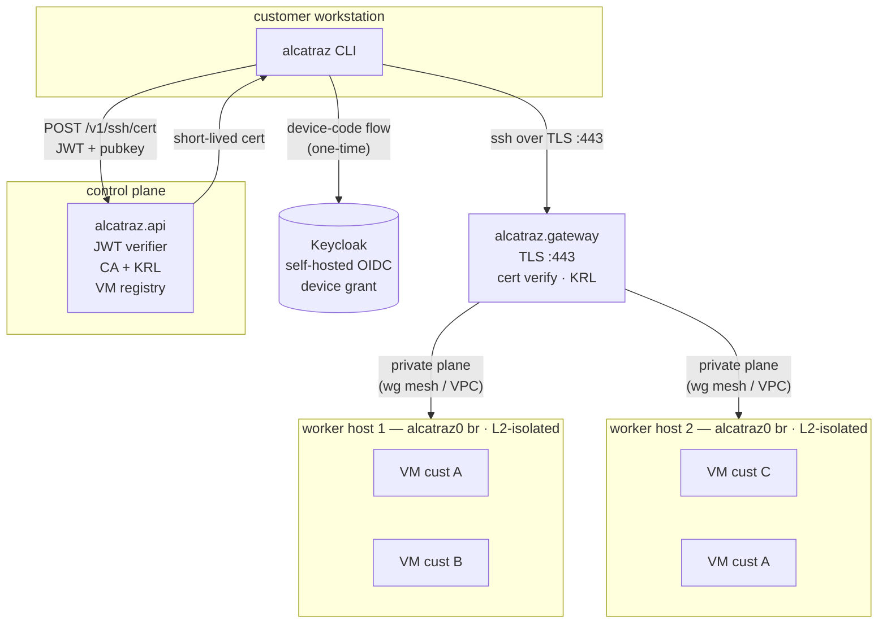
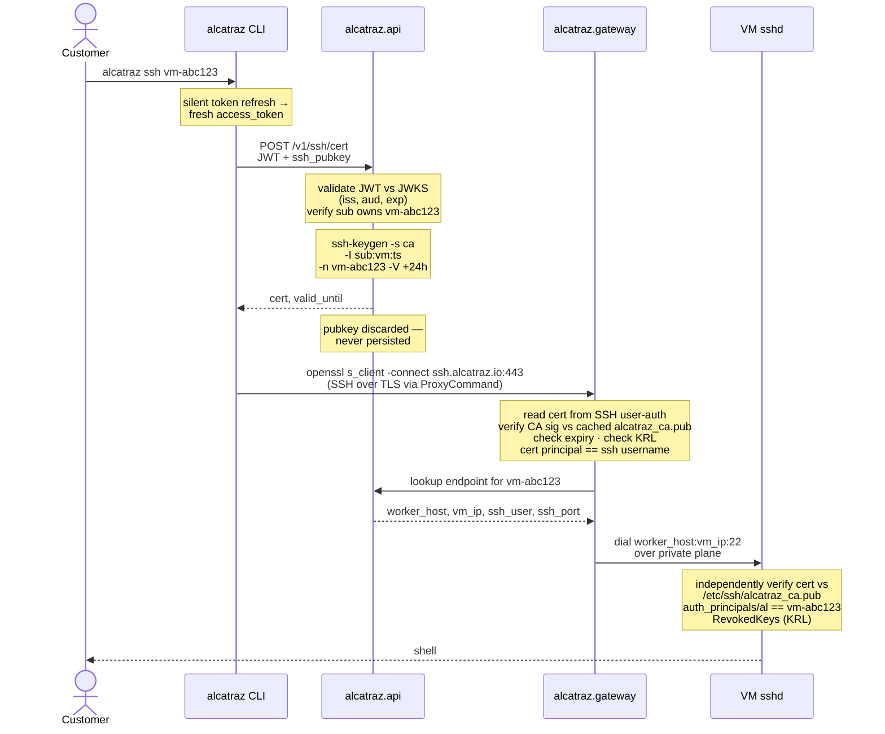

# Customer SSH Access to Firecracker VMs — Design Spec

## Context

Alcatraz is a paid serverless coding sandbox. Paying customers run their coding agents inside Firecracker microVMs and need SSH access to those VMs from their own workstations. Today the system is single-host and assumes the operator and the VMs share a machine; that model does not generalize to a multi-tenant SaaS.

This plan defines the **end-to-end design** for remote customer SSH access.The deliverable is a spec specific enough that those components can be built against it.

The objective is **secure customer → Firecracker connection**. Customer account, billing, and signup management via `alcatraz.api` is acknowledged but out of scope here.

**Hard constraints driving the design:**

1. **Customers must see only their own VM.** From a customer's perspective the worker host does not exist. They never resolve a worker hostname, never connect to a worker IP, never share a TCP session that reveals one. Defense applies at network, transport, and discovery layers.
2. **Customer ↔ customer isolation.** Customer A must never be able to reach customer B's VM, even on a misconfigured network.
3. **Multi-host worker pool.** The design must work with VMs spread across an arbitrary number of worker hosts.
4. **Frictionless client.** Customers use a stock `ssh` client; no WireGuard installs, no proprietary tooling required to connect.
5. **No long-term storage of customer SSH pubkeys.** Auth uses an SSH CA + identity provider rather than a persisted pubkey registry; nothing sensitive about customer keys is held at rest in `alcatraz.api`.

## Design Overview

`alcatraz.api` operates an SSH Certificate Authority. The CA **private** key never leaves the API box; only the CA **public** key is distributed (to VMs at image-build time, to the gateway at runtime).

**Self-hosted Keycloak** is the identity provider. Customers authenticate to the `alcatraz` CLI via OAuth 2.0 device authorization grant, then exchange the resulting access token for short-lived SSH user certs at the API. Each cert is principal-scoped to a single VM handle (`vm-abc123`) and short-TTL (24h). KRL (key revocation list) is polled by both the gateway and each VM's sshd for sub-TTL revocation.

**Public ingress is a single TLS endpoint** (`ssh.alcatraz.io:443`). `alcatraz.gateway` terminates TLS, validates the cert, looks up the VM's `(worker_host, vm_ip)` from `alcatraz.api`, and proxies bytes to the VM's `sshd` over a private control/data plane.

## Architecture

%% SSH-CA system topology

VMs run sshd with `TrustedUserCAKeys`, `AuthorizedPrincipalsFile`, and `RevokedKeys`; the public-facing surface is a single TLS endpoint at the gateway.

**Components:**

- **alcatraz.gateway** *(new)* — public TLS-terminating SSH proxy. Sole customer-facing endpoint. Stateless; verifies certs against cached CA pubkey + KRL; consults `alcatraz.api` for routing.
- **alcatraz.api** *(new)* — control plane. Owns Keycloak JWT validation, VM ownership records (keyed by Keycloak `sub`), VM endpoint state, the SSH CA private key, the cert-signing endpoint, and the KRL endpoint.
- **alcatraz CLI** *(new)* — distributed to customers. Owns OAuth device code flow, refresh-token caching, per-workstation keypair, cert fetch, and stock-ssh invocation.
- **alcatraz.worker** *(existing)* — gains thin surfaces (endpoint query, per-VM principal-file write, L2 isolation). No customer pubkey ever touches the worker.
- **alcatraz.core / rootfs** *(existing)* — ships the CA pubkey and `TrustedUserCAKeys`; no `authorized_keys` baking for customer-bound images.
- **Self-hosted Keycloak** *(prerequisite, out of scope)* — OIDC IdP for customer accounts; supports device authorization grant, exposes JWKS.

## Connection Flow

### Provisioning (image build, one-time)

- Rootfs build copies `alcatraz_ca.pub` into `/etc/ssh/alcatraz_ca.pub` (mode `0644`, root-owned). Source path supplied via env var (e.g. `ALCATRAZ_CA_PUB`).
- The sshd config fragment gains:
  - `TrustedUserCAKeys /etc/ssh/alcatraz_ca.pub`
  - `AuthorizedPrincipalsFile /etc/ssh/auth_principals/%u`
  - `RevokedKeys /etc/ssh/alcatraz_krl`
- `PasswordAuthentication` flips to `no` for customer-bound images.
- `~al/.ssh/authorized_keys` stays **empty**. The worker never writes to it.
- A KRL-refresh systemd timer is installed in the rootfs; it pulls the KRL from `alcatraz.api` over the private plane every ~60s and writes it atomically to `/etc/ssh/alcatraz_krl`.

### VM spawn (per VM)

1. Customer requests a VM via `alcatraz.api`. The API issues an opaque VM handle (`vm-abc123`) and records ownership keyed by Keycloak `sub`.
2. API asks the chosen worker host to spawn, passing `customer_id` (for log correlation only) and the VM handle.
3. Worker writes a single tiny file inside the AgentFS overlay: `/etc/ssh/auth_principals/al` containing `vm-abc123`. This forces sshd to accept only certs whose principal names this specific VM. No customer pubkey, no per-customer state on the worker.
4. Worker boots the VM and reports the endpoint to `alcatraz.api`: `{vm_id, customer_id, worker_host, vm_ip, ssh_user: al, ssh_port: 22}`.

### Customer onboarding (one-time per workstation)

1. Customer runs `alcatraz login`. CLI initiates OAuth 2.0 **device code flow** against the self-hosted Keycloak realm. Browser opens, user signs in (Keycloak handles password / MFA / federation).
2. CLI receives a refresh token, stores it under `~/.config/alcatraz/refresh_token` (mode `0600`). No pubkey leaves the workstation yet.
3. CLI generates a long-lived workstation keypair (`~/.config/alcatraz/id_alcatraz`, ed25519) on first use. The pubkey only ever leaves the workstation inside short-lived cert-signing requests.

### Connection (per SSH session)

%% Cert fetch + ssh-over-TLS via gateway, dual cert verification

1. Customer runs `alcatraz ssh vm-abc123` (or, equivalently, configures `Match`/`ProxyCommand` blocks in `~/.ssh/config` that invoke a CLI shim for the cert fetch).
2. CLI silently exchanges the cached refresh token for a Keycloak access token, then calls `POST /v1/ssh/cert` on `alcatraz.api` with `Authorization: Bearer <access_token>` and body `{vm_id, ssh_pubkey}`.
3. `alcatraz.api`:
   - Validates the JWT against Keycloak's JWKS (signature, `iss`, `aud`, `exp`). Rejects if invalid.
   - Pulls `sub`, looks up VM ownership in its own DB. Rejects if `sub` does not own `vm_id`.
   - Signs an SSH user cert with `principal = vm-abc123`, `valid_before = now + 24h`, `key_id = :<vm_id>:<issue_ts>`. No `force-command`, no `source-address`.
   - Returns `{cert, valid_until}`. The pubkey is **not persisted**.
4. CLI invokes stock SSH:
   `ssh -i ~/.config/alcatraz/id_alcatraz -i <fresh-cert-path> -o ProxyCommand="openssl s_client -quiet -connect ssh.alcatraz.io:443" vm-abc123@gateway`
5. **Gateway** terminates TLS, reads the cert from the SSH user-auth handshake, and:
   - Verifies the CA signature against its cached copy of `alcatraz_ca.pub`.
   - Confirms the cert principal matches the SSH username.
   - Confirms the cert is unexpired and absent from the KRL it polls from `alcatraz.api`.
   - Looks up `(vm-abc123) → (worker_host, vm_ip)` from `alcatraz.api` and dials over the private plane.
6. The VM's `sshd` independently verifies the cert against `/etc/ssh/alcatraz_ca.pub`, checks the principal against `/etc/ssh/auth_principals/al`, and checks `RevokedKeys`. **This is the cryptographic source of truth.** A compromised gateway alone does not yield VM access.

### VM destruction

When the VM is destroyed the AgentFS overlay is dropped (with it the `auth_principals/al` file). `alcatraz.api`'s endpoint registry no longer maps the VM handle, so the gateway returns "no such VM" for any cert still floating around. No customer key residue persists for the next VM that lands on the same slot.

## Tenant Isolation

**Network-layer isolation enforced on the worker host's bridge:**

- The worker installs `iptables`/`ebtables` rules on `alcatraz0` so that packets whose ingress and egress are both bridge-side TAP devices are dropped — VM ↔ VM traffic on the same bridge is blocked.
- Allowed traffic on the bridge: VM ↔ host gateway IP (`172.16.0.1`) for NFS root and gateway-originated SSH, and VM → outbound NAT for general internet.
- Customer-side packets only ever arrive via the gateway's inner TCP connection to `vm_ip:22`. The worker host's public NICs do **not** accept any customer-originated traffic.

**Defense-in-depth layering:**

- **Gateway** enforces "the cert presented is CA-signed, unrevoked, unexpired, and its principal matches the VM handle in the username."
- **Bridge rules** enforce "no VM may reach another VM, regardless of any application-layer mistake."
- **VM sshd** enforces "the connecting principal must hold a CA-signed cert whose principal names *this* VM, and is not in the local KRL."

A failure of any single layer does not give cross-tenant access.

## Cross-Tenant Attack Walkthrough

- *Customer A presents a valid cert for `vm-A` but tries to ssh `vm-B@gateway`:* gateway sees cert principal `vm-A` ≠ username `vm-B`, rejects. If gateway is buggy and forwards anyway, VM-B's sshd rejects: cert principal is `vm-A`, it does not match `vm-B`'s `auth_principals/al` file.
- *Customer A scans the VM subnet from inside their VM:* dropped at the bridge `iptables` rules.
- *Customer A holds a cert for `vm-A` after the VM is destroyed:* the cert may still be unexpired, but `alcatraz.api`'s endpoint registry no longer maps `vm-A` to anything — the gateway returns "no such VM."
- *Stolen cert:* expires within the 24h TTL window. For instant revocation, the cert's `key_id` is added to the KRL; gateway and VM sshd pick it up within one poll interval (~60s). Active TCP sessions may persist (sshd checks `RevokedKeys` at auth time only) — accepted trade-off for v1.
- *Compromised gateway forwarding arbitrary connections:* VM sshd still requires a CA-signed cert with the right principal. Gateway compromise alone does not yield VM access.

## Worker Surfaces (implementation deferred)

When `alcatraz.api` and `alcatraz.gateway` land, `alcatraz.worker` will need:

1. **VM endpoint query** — a NATS request/reply topic such as `alcatraz.worker.vms.get` returning `{worker_host, vm_ip, ssh_user, ssh_port, customer_id}` for a given VM handle. State already exists in `alcatraz.worker/internal/vm/machine.go:14-83` (`GetVMIP`, `hostTapIP`) and `alcatraz.worker/internal/vm/spawn.go:154-169`; only the surface is missing.

2. **Per-VM principal write** — on spawn, the worker writes `/etc/ssh/auth_principals/al` containing the VM handle into the AgentFS overlay (mode `0644`, root-owned). Failure to write must abort the spawn. This is the only SSH-related worker write — no customer pubkey is ever handled by the worker.

3. **Per-VM L2 isolation rules** — on TAP creation in the spawn flow, the worker adds the inter-VM drop rules described above; on cleanup it removes them. Pairs with `alcatraz.worker/cni/alcatraz-bridge.conflist`.

The spawn payload may gain `customer_id` for accounting/log correlation but does **not** gain `customer_pubkey`.

## Required Changes

### `alcatraz.core/build-rootfs.sh` (image build)
- **Add:** copy `${ALCATRAZ_CA_PUB}` into `/etc/ssh/alcatraz_ca.pub` (mode `0644`, root-owned).
- **Add:** in the sshd config fragment at lines 238–255, append `TrustedUserCAKeys /etc/ssh/alcatraz_ca.pub`, `AuthorizedPrincipalsFile /etc/ssh/auth_principals/%u`, and `RevokedKeys /etc/ssh/alcatraz_krl`.
- **Remove:** the `HOST_SSH_DIR → ~al/.ssh/authorized_keys` baking at lines 251–254 for customer-bound images (gate behind a build flag for dev images).
- **Set:** `PasswordAuthentication no` (line ~239) for customer-bound images.
- **Add:** install a KRL-refresh systemd timer that polls `alcatraz.api` over the private plane every ~60s and atomically writes `/etc/ssh/alcatraz_krl`.

### `alcatraz.worker` (thin)
- Add NATS topic `alcatraz.worker.vms.get` returning the endpoint tuple (Surface #1).
- On spawn, write `/etc/ssh/auth_principals/al = <vm_id>` into the AgentFS overlay (Surface #2).
- Add per-VM `iptables`/`ebtables` drop rules on TAP creation; remove on cleanup (Surface #3).
- `CreateVirtualMachineInput` (`alcatraz.worker/internal/vm/config.go:50-55`) gains `customer_id`. No `customer_pubkey`.

### `alcatraz.api` (new)
- **Keycloak JWT validation** middleware. Caches Keycloak JWKS, verifies `iss` matches the configured realm issuer, `aud` matches alcatraz's client ID, `exp` not in the past. `sub` becomes the customer principal for downstream lookups.
- **CA key custody.** Generate once (Ed25519). Private key encrypted at rest, decrypted only inside the signing path. Rotation via dual-CA window.
- `POST /v1/ssh/cert` — Keycloak-authenticated. Body `{vm_id, ssh_pubkey}`. Response `{cert, valid_until}`. Verifies `sub` owns `vm_id`. Signs via `golang.org/x/crypto/ssh.Certificate.SignCert` (equivalent to `ssh-keygen -s ca -I <key_id> -n <principal> -V +1440m`). Pubkey discarded after signing.
- `GET /v1/ssh/krl` — returns the current revocation list, signed by the CA. Gateway and VM-side timer poll periodically.
- VM ownership / endpoint registry, keyed by Keycloak `sub`.

### `alcatraz.gateway` (new)
- Public TLS termination on `:443` for `ssh.alcatraz.io`.
- Reads the SSH cert from the user-auth handshake. Verifies CA signature against cached `alcatraz_ca.pub`, checks expiry, checks KRL.
- Confirms cert principal matches SSH username.
- Looks up `(vm_id) → (worker_host, vm_ip)` from `alcatraz.api`; dials over the private plane.
- Streams bytes between customer and VM. Stateless; horizontally scalable.

### `alcatraz` CLI (new)
- `alcatraz login` — device code flow against Keycloak, cache refresh token at `~/.config/alcatraz/refresh_token` (mode `0600`).
- `alcatraz ssh <vm_id>` — silent token refresh → `POST /v1/ssh/cert` → invoke stock `ssh -i id_alcatraz -i <cert> -o ProxyCommand="openssl s_client -quiet -connect ssh.alcatraz.io:443" <vm_id>@gateway`.
- Generates and reuses a per-workstation ed25519 keypair on first use; only ever offers the pubkey inside cert-signing requests.

### Self-hosted Keycloak (prerequisite, out of scope)
Operates a realm for alcatraz customers, exposes OIDC discovery + JWKS, supports the device authorization grant. Deployment, hardening, and customer signup flows are out of scope here but blocking for v1.

## Locked-In Parameters

- **Principal scope:** per-VM (`vm-abc123`). Each cert is bound to exactly one VM. The VM's own sshd rejects any cross-VM principal mismatch independently of the gateway.
- **Cert TTL:** 24 hours. Optimized for long-running interactive shells. KRL is therefore load-bearing for revocation.
- **KRL poll interval:** ~60s at gateway and inside each VM. Active sessions may persist past revocation.
- **Identity:** self-hosted Keycloak, OAuth 2.0 device authorization grant, validated at `alcatraz.api` via cached JWKS.
- **CA algorithm:** Ed25519. Rotation via dual-CA window (VMs trust both old and new pubkeys during overlap).

## Out of Scope (Known Prerequisites)

These are real blockers explicitly outside *this plan*. Documented so they aren't lost:

1. **Per-host VM subnet allocation.** Today every worker hardcodes `172.16.0.0/24` (`alcatraz.worker/cni/alcatraz-bridge.conflist`). Two worker hosts will mint colliding VM IPs, breaking the gateway's `(worker_host, vm_ip)` routing tuple. Must be solved before two workers operate concurrently — likely a per-host /24 carved from `172.16.0.0/16`, configured at worker startup.
2. **alcatraz.gateway implementation.** TLS termination, SSH protocol handling, cert verification, KRL polling, connection accounting, rate limiting, observability.
3. **alcatraz.api implementation.** Keycloak integration, CA custody, cert signing, KRL endpoint, VM ownership/endpoint registry.
4. **alcatraz CLI implementation.** Device code flow, token cache, cert fetch, stock-ssh invocation.
5. **Gateway↔worker private control/data plane.** Transport between gateway and worker hosts (likely WireGuard mesh) is implementation-specific infra. Must not be reachable from the public internet or from inside customer VMs.
6. **Self-hosted Keycloak.** Deployment, hardening, signup flows.
7. **Customer account / billing management** in `alcatraz.api` beyond what's needed to map a Keycloak `sub` to VM ownership.

## Critical Files (reference only — not modified by *this plan*; touched by future implementation)

- `alcatraz.core/build-rootfs.sh:238-255, 344-350` — sshd config fragment and ephemeral host key generation; CA delta lands here.
- `alcatraz.worker/internal/vm/spawn.go:80-86, 154-169` — boot path; future site for principal-file write and endpoint reporting.
- `alcatraz.worker/internal/vm/machine.go:14-83, 180-199` — `VirtualMachine` state and `VirtualMachineService` registry; data backing the future NATS query topic.
- `alcatraz.worker/internal/vm/agentfs/overlay.go:56-109` — overlay prepare path; future site for the principal-file write.
- `alcatraz.worker/internal/vm/config.go:50-55` — `CreateVirtualMachineInput`; gains `customer_id`.
- `alcatraz.worker/cni/alcatraz-bridge.conflist` — bridge config; companion to the future L2 isolation rules and per-host subnet split.
- `alcatraz.worker/README.md` — currently documents the local-only access model; needs a section describing the customer access flow once components ship.

## Verification (design walkthroughs)

Since this plan is a design spec with no code changes, "verification" means confirming the spec is internally consistent and satisfies the constraints. Walkthroughs to perform as a review:

1. **Customer-perspective trace.** Follow the connection flow from `ssh` invocation to VM shell. Confirm no step exposes worker host identity (hostname, IP, certificate CN) to the customer. The TLS cert presented should be `ssh.alcatraz.io`, never a worker host.
2. **No-persisted-pubkey trace.** Walk through what `alcatraz.api` stores about a customer end-to-end. Confirm no field of any table holds a customer's SSH pubkey at rest. Confirm the signing endpoint discards the pubkey after producing the cert.
3. **Keycloak JWT verification trace.** Submit `POST /v1/ssh/cert` with: (a) a valid token, (b) a token signed by a different IdP, (c) an expired token, (d) a token with the wrong audience. Confirm only (a) succeeds and the rest fail at the JWT middleware before reaching CA logic.
4. **Stock-client trace.** From a clean workstation, simulate the CLI's `alcatraz ssh` end-to-end: device-code login → token exchange → cert fetch → stock `ssh -i id -i cert ...`. Confirm only OpenSSH-stock invocations are needed once the cert is in hand.
5. **Cross-tenant attack walkthrough.** Customer A holds a valid cert for `vm-A`. Walk through (a) substituting `vm-B` in the SSH username, (b) scanning the VM subnet from inside their own VM, (c) presenting the cert after `vm-A` is destroyed. All three must fail at clearly identified layers.
6. **Cert-principal mismatch.** Sign a cert for `vm-A`, attempt to use it against `vm-B`. Confirm rejection at gateway *and* at the VM sshd.
7. **TTL expiry.** Use a cert past `valid_until` (≥24h old). Confirm rejection at both layers.
8. **KRL revocation propagation.** Issue a cert, then add its `key_id` to the KRL via an admin path on `alcatraz.api`. Within one poll interval (~60s), confirm: (a) the gateway rejects new connections, (b) the VM sshd rejects it independently. Note that active TCP streams may persist.
9. **Multi-worker placement.** A customer's two VMs land on two different worker hosts. Confirm the gateway can route both independently and that traffic to one never traverses the other host.
10. **CA rotation.** Walk the steps to roll the CA key, including dual-CA window where VMs trust both old and new pubkeys.
11. **Defense-in-depth, single-layer failure.** Assume the gateway is fully compromised and forwards arbitrary connections to `vm-A`. Confirm the VM sshd still requires a CA-signed cert with the right principal — gateway compromise alone does not yield VM access.
12. **Spec-to-implementation handoff.** Confirm the worker surfaces (#1 endpoint query, #2 principal-file write, #3 L2 isolation), the rootfs delta, and the `alcatraz.api` / `alcatraz.gateway` / CLI specs taken together are sufficient for implementation against without further worker-side decisions.
